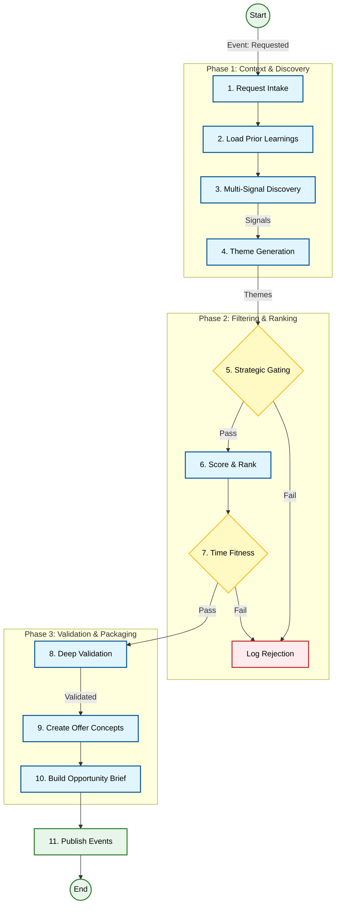

# 🕵️ 03. Product Research Agent (The Hunter)

## 1. Executive Summary
The **Product Research Agent** is the "Hunter" of the swarm. Its sole purpose is to scan the market, identify trending niches, and surface high-potential products that meet specific criteria (e.g., high demand, low competition).

Unlike simple scrapers, this agent acts as a **Strategic Analyst**. It doesn't just find products; it builds a business case for them. It ingests raw signals, clusters them into themes, validates them against strict kill criteria, and produces a comprehensive **Opportunity Brief** that downstream agents can execute without ambiguity.

---

## 2. Core Responsibilities
*   **Market Scanning**: Continuously monitors social media (TikTok, Pinterest), search engines (Google Trends), and marketplaces (Amazon, AliExpress) for emerging signals.
*   **Theme Generation**: Clusters disparate signals into coherent product themes (e.g., "At-home Cryotherapy" from signals about "ice rollers" and "cold plunges").
*   **Strategic Gating**: Enforces the business's risk profile by killing ideas that are too low-margin, too risky, or off-brand.
*   **Deep Validation**: rigorous checks on competition density, pricing viability, and seasonality.
*   **Brief Creation**: Packages the validated opportunity into a structured JSON artifact (`OpportunityBrief`) containing 14 distinct sections of analysis.

---

## 3. Internal Logic Flow (The 11-Step Pipeline)

The agent executes a rigorous pipeline to ensure only high-quality, validated opportunities reach the CEO.



### Detailed Step Execution

#### Phase 1: Context & Discovery
1.  **Request Intake & Normalization**: Parses the `ResearchRequest` (e.g., "Find Pet Products") and aligns it with the global `StrategyProfile`.
2.  **Prior Learning Ingestion**: Queries the `PersistencePort` for past failures/successes in the category to generate `RiskAdjustment` factors (e.g., "Avoid electronics in Pet category due to high returns").
3.  **Multi-Signal Discovery**: Uses MCP tools (`trend_adapter`, `competitor_adapter`) to gather raw data points (`Signal[]`) from various sources.
4.  **Theme Generation**: Clusters raw signals into `Theme[]` objects. A theme represents a potential product direction rather than a specific SKU.

#### Phase 2: Filtering & Ranking
5.  **Strategic Gating**: The "Kill Switch". Checks themes against hard constraints (Margin > 20%, Category Allowed).
6.  **Scoring & Ranking**: Calculates a weighted score (0-100) based on signal volume, velocity, and risk adjustments.
7.  **Time & Cycle Fitness**: Analyzes the `TrendPhase`. Rejects themes that are "Too Early" (unproven) or "Too Late" (saturated).

#### Phase 3: Validation & Packaging
8.  **Deep Validation**: Performs specific checks on the surviving themes:
    *   **Competition Density**: How many sellers?
    *   **Price Band**: Is there room for profit?
    *   **Seasonality**: Is it a fad?
9.  **Productization (Offer Concepts)**: Transforms a "Theme" into a concrete `ProductConcept` with a core hypothesis, target persona, and differentiation strategy.
10. **Opportunity Brief Creation**: Maps all data into the strict `OpportunityBrief` schema. Populates critical sections like `kill_criteria`, `validation_plan`, and `assumptions_and_certainty`.
11. **Handoff**: Publishes `OpportunityResearch.BriefsPublished` to the Event Bus.

---

## 4. Data Structures

### Opportunity Brief (The Artifact)
The central JSON document passed to downstream agents. It is strictly typed and validated.

```typescript
export interface OpportunityBrief {
    meta: OpportunityBriefMeta;
    opportunity_definition: OpportunityDefinition;
    customer_problem: CustomerProblem;
    demand_evidence: DemandEvidence;
    competition_analysis: CompetitionAnalysis;
    pricing_and_economics: PricingAndEconomics;
    offer_concept: OfferConcept;
    differentiation_strategy: DifferentiationStrategy;
    risk_assessment: RiskAssessment;
    time_and_cycle: TimeAndCycle;
    validation_plan: ValidationPlan;
    kill_criteria: KillCriteria;
    assumptions_and_certainty: AssumptionsAndCertainty;
    evidence_references: EvidenceReferences;
}
```

### Signal
Raw market data points.
```typescript
interface Signal {
    id: string;
    family: 'social' | 'search' | 'marketplace' | 'competitor';
    source: string; // e.g., "TikTok", "Google Trends"
    data: any;
}
```

### Theme
Clustered signals representing a potential opportunity.
```typescript
interface Theme {
    id: string;
    name: string;
    supporting_signals: string[]; // IDs
    score: number;
    validation: ValidationData;
}
```

---

## 5. Event Interface

### Subscribes To
| Event | Source | Action |
| :--- | :--- | :--- |
| `OpportunityResearch.Requested` | CEO Agent / Scheduler | Triggers the 11-step pipeline. Payload: `{ request_id, criteria }` |

### Publishes
| Event | Payload | Description |
| :--- | :--- | :--- |
| `OpportunityResearch.BriefsPublished` | `{ brief_id, briefs[] }` | The primary output. Contains the full `OpportunityBrief` objects. |
| `OpportunityResearch.SignalsCollected` | `{ signal_count, sources }` | Emitted for the Analytics Agent to track market coverage. |
| `OpportunityResearch.ShortlistRanked` | `{ candidates[] }` | Emitted for observability of the ranking process. |

---

## 6. Toolbox (MCP Integrations)

The agent relies on the **Model Context Protocol (MCP)** to interface with external tools.

| Tool Category | Adapter Port | Purpose | Example Tools |
| :--- | :--- | :--- | :--- |
| **Trends** | `TrendAnalysisPort` | Identify rising keywords and consumer interests. | `google_trends`, `pinterest_trends` |
| **Competitors** | `CompetitorAnalysisPort` | Analyze market saturation, pricing, and existing offers. | `amazon_scraper`, `tiktok_creative_center` |
| **Database** | `PersistencePort` | Retrieve past learnings and store new briefs. | `postgres`, `vector_db` |

---

## 7. Configuration & Strategy

The agent's behavior is governed by the `StrategyProfile`, which is loaded at runtime (Step 1).

### Strategy Profile Example
```json
{
    "risk_tolerance": "medium",
    "target_margin": 0.25,
    "allowed_categories": ["Home", "Pet", "Wellness"],
    "excluded_keywords": ["electronics", "batteries", "fragile"],
    "min_demand_signals": 3
}
```

### Kill Criteria Generation
In Step 10, the agent generates specific "Kill Criteria" for the CEO to monitor.
*   **Hard Kill**: "CPC > $2.00", "Supplier Lead Time > 30 Days".
*   **Soft Warning**: "Competitor launches similar product".

---

## 8. Future Roadmap
*   **Visual Analysis**: Integrating Vision LLMs to analyze product images from social media signals.
*   **Sentiment Analysis**: Deeper NLP on customer reviews to identify "Customer Problem" more accurately.
*   **Real-time Feedback**: Listening to `Marketing.CampaignResult` events to update `PriorLearnings` automatically.
