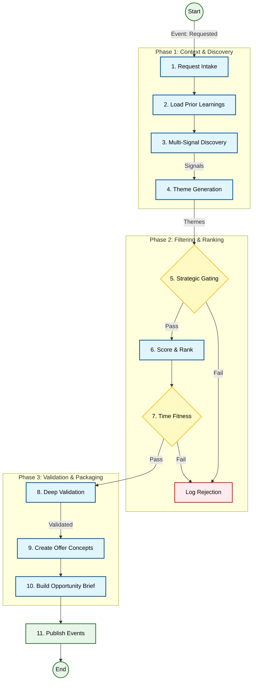

# 🕵️ 03. Product Research Agent (The Hunter)

## 1. Executive Summary
The **Product Research Agent** is the "Hunter" of the swarm. Its sole purpose is to scan the market, identify trending niches, and surface high-potential products that meet specific criteria (e.g., high demand, low competition).

Unlike simple scrapers, this agent acts as a **Strategic Analyst**. It doesn't just find products; it builds a business case for them. It ingests raw signals, clusters them into themes, validates them against strict kill criteria, and produces a comprehensive **Opportunity Brief** that downstream agents can execute without ambiguity.

---

## 2. Core Responsibilities
*   **Market Scanning**: Continuously monitors social media (TikTok, Pinterest), search engines (Google Trends), and marketplaces (Amazon, AliExpress) for emerging signals.
*   **Theme Generation**: Clusters disparate signals into coherent product themes (e.g., "At-home Cryotherapy" from signals about "ice rollers" and "cold plunges").
*   **Strategic Gating**: Enforces the business's risk profile by killing ideas that are too low-margin, too risky, or off-brand.
*   **Deep Validation**: rigorous checks on competition density, pricing viability, and seasonality.
*   **Brief Creation**: Packages the validated opportunity into a structured JSON artifact (`OpportunityBrief`) containing 14 distinct sections of analysis.

---

## 3. Internal Logic Flow (The 11-Step Pipeline)

The agent executes a rigorous pipeline to ensure only high-quality, validated opportunities reach the CEO.



### Detailed Step Execution

#### Phase 1: Context & Discovery
1.  **Request Intake & Normalization**:
    *   **Purpose**: Converts a vague human request (e.g., "Find Pet Products") into a structured strategic directive.
    *   **Actions**: Uses OpenAI to parse the request against the `StrategyProfile`. Determines seasonal windows, target personas, and execution speed (Fast/Normal/Thorough).
    *   **MCP/API**: `OpenAI (Chat Completion)` -> Returns `ResearchBrief` JSON.

2.  **Prior Learning Ingestion**:
    *   **Purpose**: Prevents repeating past mistakes by loading historical context.
    *   **Actions**: Queries the `PersistencePort` for past products in the target category. Calculates success/failure rates. Applies "Risk Adjustments" (e.g., -10% score for "Electronics" due to high returns).
    *   **MCP/API**: `PersistencePort.getProducts('live')`.

3.  **Multi-Signal Discovery**:
    *   **Purpose**: Gathers raw market data from multiple independent sources to form a "Triangulated" view.
    *   **Actions**:
        1.  Generates search keywords using OpenAI.
        2.  **Search Signals**: Calls `TrendAnalysisPort.findProducts(keyword)` (Google Trends/BigQuery).
        3.  **Competitor Signals**: Calls `CompetitorAnalysisPort.analyzeCompetitors(product)` to find existing sellers.
    *   **MCP/API**: `GoogleTrendsAdapter`, `CompetitorAdapter`, `OpenAI`.

4.  **Theme Generation**:
    *   **Purpose**: Clusters disparate signals into coherent product opportunities.
    *   **Actions**: Groups signals by product name or keyword. Assigns a "Certainty" level:
        *   *Observed*: Supported by multiple signal families (e.g., Search + Competitor).
        *   *Inferred*: Supported by only one source.
    *   **MCP/API**: Internal Clustering Logic.

#### Phase 2: Filtering & Ranking
5.  **Strategic Gating**:
    *   **Purpose**: The "Kill Switch". Immediately discards ideas that violate business rules.
    *   **Actions**: Checks themes against:
        *   **Blacklist**: Weapons, drugs, adult content.
        *   **Fulfillment Risks**: Glass, liquids, heavy items.
        *   **Strategy Profile**: Allowed categories and margin constraints.
    *   **MCP/API**: Internal Logic.

6.  **Scoring & Ranking**:
    *   **Purpose**: Prioritizes opportunities based on potential and risk.
    *   **Actions**: Calculates a weighted score (0-100) based on:
        *   Signal Velocity (Trend growth).
        *   Signal Diversity (Certainty bonus).
        *   Risk Adjustments (from Step 2).
    *   **MCP/API**: Internal Logic.

7.  **Time & Cycle Fitness**:
    *   **Purpose**: Ensures the opportunity is actionable *now*.
    *   **Actions**: Estimates the **Trend Phase** (Early, Mid, Late) and **Opportunity Window** (Days remaining). Rejects themes where the window < execution time (e.g., "Too Late" for a 30-day launch).
    *   **MCP/API**: Internal Logic.

#### Phase 3: Validation & Packaging
8.  **Deep Validation**:
    *   **Purpose**: Rigorous stress-testing of the top 5 candidates.
    *   **Actions**: Simulates a "Deep Scan" to generate:
        *   **Qualitative Data**: Customer reviews/complaints.
        *   **Competition Quality**: Weak vs. Strong incumbents.
        *   **Price Band**: Min/Max viable pricing.
    *   **MCP/API**: Internal Logic (Mocked in MVP, would be Social Listening/Scraper).

9.  **Productization (Offer Concepts)**:
    *   **Purpose**: Transforms a raw "Theme" into a sellable "Concept".
    *   **Actions**: Defines the **Core Hypothesis**, **Target Persona**, **Usage Scenario**, and **Differentiation Strategy** (e.g., "Better packaging + Eco-friendly materials").
    *   **MCP/API**: Internal Logic (Mocked in MVP, would be LLM).

10. **Opportunity Brief Creation**:
    *   **Purpose**: Creates the final artifact for the CEO.
    *   **Actions**: Maps all collected data into the strict 14-section `OpportunityBrief` schema. Populates `kill_criteria`, `validation_plan`, and `risk_assessment`. Saves the brief to the Database.
    *   **MCP/API**: `PersistencePort.saveBrief()`.

11. **Handoff via Events**:
    *   **Purpose**: Triggers the next phase of the business lifecycle.
    *   **Actions**: Publishes events to wake up downstream agents:
        *   `Supplier.FeasibilityRequested`: "Can we source this?"
        *   `Marketing.AngleWhitespaceRequested`: "How do we sell this?"
    *   **MCP/API**: `EventBus.publish()`.

---

## 4. Data Structures

### Opportunity Brief (The Artifact)
The central JSON document passed to downstream agents. It is strictly typed and validated.

```typescript
export interface OpportunityBrief {
    meta: OpportunityBriefMeta;
    opportunity_definition: OpportunityDefinition;
    customer_problem: CustomerProblem;
    demand_evidence: DemandEvidence;
    competition_analysis: CompetitionAnalysis;
    pricing_and_economics: PricingAndEconomics;
    offer_concept: OfferConcept;
    differentiation_strategy: DifferentiationStrategy;
    risk_assessment: RiskAssessment;
    time_and_cycle: TimeAndCycle;
    validation_plan: ValidationPlan;
    kill_criteria: KillCriteria;
    assumptions_and_certainty: AssumptionsAndCertainty;
    evidence_references: EvidenceReferences;
}
```

### Signal
Raw market data points.
```typescript
interface Signal {
    id: string;
    family: 'social' | 'search' | 'marketplace' | 'competitor';
    source: string; // e.g., "TikTok", "Google Trends"
    data: any;
}
```

### Theme
Clustered signals representing a potential opportunity.
```typescript
interface Theme {
    id: string;
    name: string;
    supporting_signals: string[]; // IDs
    score: number;
    validation: ValidationData;
}
```

---

## 5. Event Interface

### Subscribes To
| Event | Source | Action |
| :--- | :--- | :--- |
| `OpportunityResearch.Requested` | CEO Agent / Scheduler | Triggers the 11-step pipeline. Payload: `{ request_id, criteria }` |

### Publishes
| Event | Payload | Description |
| :--- | :--- | :--- |
| `OpportunityResearch.BriefsPublished` | `{ brief_id, briefs[] }` | The primary output. Contains the full `OpportunityBrief` objects. |
| `OpportunityResearch.SignalsCollected` | `{ signal_count, sources }` | Emitted for the Analytics Agent to track market coverage. |
| `OpportunityResearch.ShortlistRanked` | `{ candidates[] }` | Emitted for observability of the ranking process. |

---

## 6. Toolbox (MCP Integrations)

The agent relies on the **Model Context Protocol (MCP)** to interface with external tools.

| Tool Category | Adapter Port | Purpose | Example Tools |
| :--- | :--- | :--- | :--- |
| **Trends** | `TrendAnalysisPort` | Identify rising keywords and consumer interests. | `google_trends`, `pinterest_trends` |
| **Competitors** | `CompetitorAnalysisPort` | Analyze market saturation, pricing, and existing offers. | `amazon_scraper`, `tiktok_creative_center` |
| **Database** | `PersistencePort` | Retrieve past learnings and store new briefs. | `postgres`, `vector_db` |

### Current Integration Status (MV-PRA)
*Status as of Dec 21, 2025*

**Overall State:** "Brain Ready, Senses Numb"
The agent logic (Brain) is fully implemented with the 11-step pipeline and schema. The external sensors (Adapters) are currently mocks or stubs.

| Integration | Priority | Status | Implementation Notes |
| :--- | :--- | :--- | :--- |
| **Google Trends** | Tier 1 | 🟡 Partial | `LiveTrendAdapter` uses `google-trends-api` (unofficial). Covers interest over time. |
| **Google Ads (Keywords)** | Tier 1 | 🟡 Partial | `LiveAdsAdapter` implemented with `google-ads-api` but requires valid credentials/customer ID. |
| **Meta Ad Library** | Tier 1 | 🔴 Missing | `LiveCompetitorAdapter` is a stub. Required for saturation checks. |
| **YouTube Data** | Tier 1 | 🔴 Missing | No implementation. |
| **Shopify Admin** | Tier 1 | 🔴 Missing | No implementation. |
| **Competitor Scraper** | Tier 1 | ⚪ Stub | `LiveCompetitorAdapter` exists but throws "Not Implemented". |

**Immediate Next Steps:**
1.  **Implement `LiveCompetitorAdapter`**: Basic scraping or API calls to fetch competitor pricing/offers.
2.  **Implement `LiveAdsAdapter` (Read-Only)**: Connect to Meta Ad Library for "Evidence" collection.

### Path to Full Maturity (Post-MVP)
To evolve from MV-PRA to a fully autonomous "Hunter", the following integrations (Tier 2 & 3) are required:

| Integration | Tier | Purpose |
| :--- | :--- | :--- |
| **Instagram Graph API** | Tier 2 | Hashtag trend scanning & visual theme discovery. |
| **Pinterest API v5** | Tier 2 | Seasonal intent & aesthetic trend validation (Home/Decor). |
| **TikTok Business API** | Tier 3 | Viral trend spotting & creative format analysis. |
| **Amazon SP-API** | Tier 3 | Price band validation & listing density checks. |
| **Alibaba Open Platform** | Tier 3 | Supplier availability & COGS estimation signals. |

---

## 7. Configuration & Strategy

The agent's behavior is governed by the `StrategyProfile`, which is loaded at runtime (Step 1).

### Strategy Profile Example
```json
{
    "risk_tolerance": "medium",
    "target_margin": 0.25,
    "allowed_categories": ["Home", "Pet", "Wellness"],
    "excluded_keywords": ["electronics", "batteries", "fragile"],
    "min_demand_signals": 3
}
```

### Kill Criteria Generation
In Step 10, the agent generates specific "Kill Criteria" for the CEO to monitor.
*   **Hard Kill**: "CPC > $2.00", "Supplier Lead Time > 30 Days".
*   **Soft Warning**: "Competitor launches similar product".

---

## 8. Future Roadmap
*   **Visual Analysis**: Integrating Vision LLMs to analyze product images from social media signals.
*   **Sentiment Analysis**: Deeper NLP on customer reviews to identify "Customer Problem" more accurately.
*   **Real-time Feedback**: Listening to `Marketing.CampaignResult` events to update `PriorLearnings` automatically.
