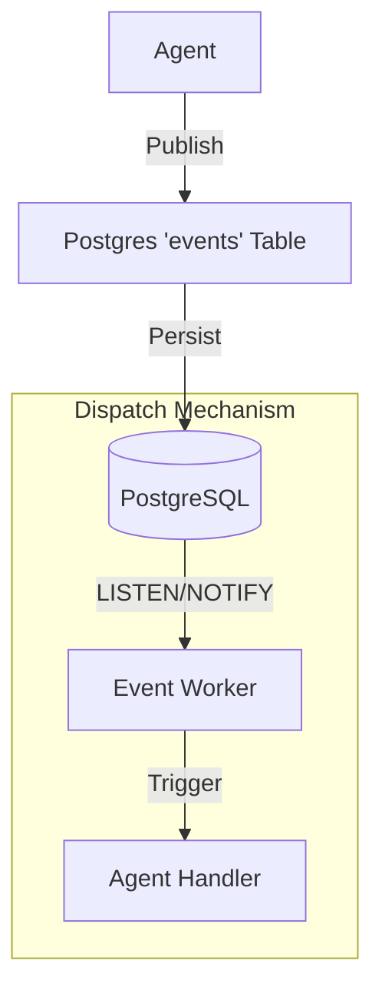

# 🧠 01. Event-Driven Architecture (EDA)

**Status:** Implemented (Core) / In Progress (Dispatch)
**Date:** December 2025
**Objective:** Decouple the Agent Swarm from synchronous loops using a persistent Event Bus.

## 1. The Problem
A linear script (`step 1 -> step 2`) cannot handle the asynchronous nature of a real business.
*   **Webhooks:** Shopify sends data whenever it wants.
*   **Long-running tasks:** Researching products takes time; we shouldn't block the Customer Service agent.
*   **Resilience:** If the server crashes, in-memory events are lost.

## 2. The Solution: Postgres Event Store

We have implemented `PostgresEventStore` which acts as the central nervous system.

### 2.1 Architecture



### 2.2 The Schema

Events are stored permanently for audit trails and replayability.

```sql
CREATE TABLE events (
  id SERIAL PRIMARY KEY,
  topic VARCHAR(255) NOT NULL,      -- e.g., 'PRODUCT_FOUND'
  event_type VARCHAR(255) NOT NULL, -- e.g., 'PRODUCT_FOUND' (redundant but useful)
  payload JSONB NOT NULL,           -- The data
  source VARCHAR(255),              -- Who sent it?
  created_at TIMESTAMP DEFAULT NOW()
);
```

### 2.3 Dispatch Strategies

We support two modes of dispatching events to subscribers:

#### A. In-Memory (Simulation / Dev)
*   **Mechanism:** When `publish()` is called, the class immediately iterates through an in-memory array of callbacks and executes them.
*   **Pros:** Instant, easy to debug.
*   **Cons:** Not scalable across multiple servers.

#### B. Postgres LISTEN/NOTIFY (Production)
*   **Mechanism:**
    1.  `publish()` executes `NOTIFY channel, payload`.
    2.  Subscribers use `LISTEN channel`.
    3.  When a notification arrives, the worker triggers the agent.
*   **Pros:** Scalable, persistent, works with multiple instances.
*   **Cons:** Requires a running Postgres instance.

## 3. Current Implementation Status

*   **Class:** `src/infra/eventbus/PostgresEventStore.ts`
*   **Persistence:** ✅ Implemented. All events are saved to the DB.
*   **Subscription:** ⚠️ **Partial**. The current `subscribe` method logs the subscription but does not yet wire up the `LISTEN` mechanism or in-memory callback loop.
    *   *Action Item:* Update `PostgresEventStore` to maintain an in-memory list of handlers for the simulation loop to function correctly.

## 4. Core Events

| Event Name | Trigger | Subscriber(s) | Action |
| :--- | :--- | :--- | :--- |
| `PRODUCT_FOUND` | Research Agent | CEO Agent | Review product candidate. |
| `PRODUCT_APPROVED` | CEO Agent | Supplier Agent | Find suppliers. |
| `SUPPLIER_APPROVED` | CEO Agent | Store Build Agent | Create product page. |
| `PRODUCT_PAGE_CREATED` | Store Agent | Marketing Agent | Launch ads. |
| `ORDER_RECEIVED` | Webhook | Operations Agent | Fulfill order. |
| `ORDER_SHIPPED` | Operations Agent | CS Agent | Notify customer. |
