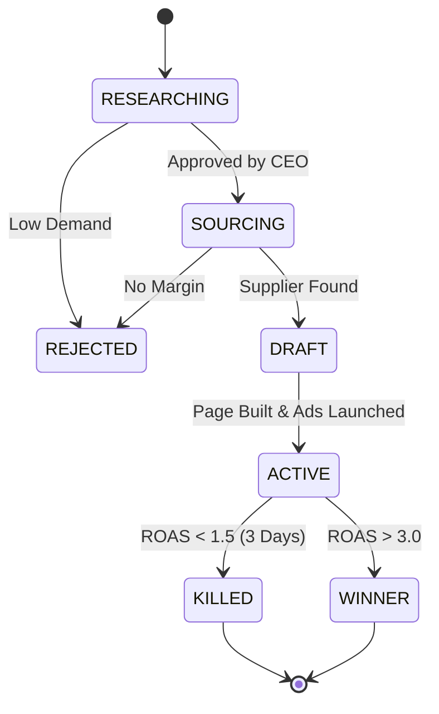

# 🧠 02. Multi-Product Architecture

**Status:** Draft
**Date:** December 2025
**Objective:** Scale the system from managing a single product to a full Catalog (10-100 SKUs) using PostgreSQL.

## 1. The Problem
The initial prototype assumed a "One Product Store" model.
*   **Legacy State:** Agents operated on a global context (e.g., "Run Ads" meant "Run ads for *the* product").
*   **Limitation:** We cannot test multiple niches simultaneously or scale "Winners" while killing "Losers".

## 2. The Solution: Postgres Catalog

We treat the business as a portfolio of assets. Each product is an independent entity with its own lifecycle, budget, and performance metrics.

### 2.1 Database Schema

We replace the JSON file with a robust `products` table.

```sql
CREATE TABLE products (
  id SERIAL PRIMARY KEY,
  name VARCHAR(255) NOT NULL,
  description TEXT,
  category VARCHAR(100),
  
  -- Lifecycle
  status VARCHAR(50) DEFAULT 'RESEARCHING', -- RESEARCHING, SOURCING, DRAFT, ACTIVE, KILLED, WINNER
  created_at TIMESTAMP DEFAULT NOW(),
  launched_at TIMESTAMP,
  
  -- Financials (Snapshots)
  target_cpa DECIMAL(10, 2),
  current_roas DECIMAL(10, 2),
  total_spend DECIMAL(10, 2) DEFAULT 0,
  total_revenue DECIMAL(10, 2) DEFAULT 0,
  
  -- External IDs
  shopify_product_id VARCHAR(255),
  supplier_id VARCHAR(255)
);
```

### 2.2 The Product Lifecycle

Every product moves through a strict state machine managed by the CEO Agent.



## 3. Agent Logic Updates

### Product Research Agent
*   **Old:** Find a product -> Overwrite global state.
*   **New:** Find a product -> Insert into `products` table with status `RESEARCHING`.
*   **Constraint:** The CEO limits the number of active "Tests" (e.g., Max 5 products in `ACTIVE` state) to conserve budget.

### Marketing Agent
*   **Old:** "Optimize Ads" (Global).
*   **New:** Loop through all products where `status = 'ACTIVE'`.
    *   Fetch `campaign_id` for `product_id`.
    *   Check ROAS for *that specific product*.
    *   Decision: Kill Campaign or Scale Budget.

### Operations Agent
*   **Old:** Fulfill "The Order".
*   **New:** When `ORDER_RECEIVED` arrives:
    *   Parse `line_items`.
    *   For each item, look up the `supplier_id` in the `products` table.
    *   Route fulfillment to the correct supplier.

## 4. Implementation Plan

### Phase 1: Schema Migration
1.  Create the `products` table in Postgres.
2.  Update `PersistencePort` to support `createProduct()`, `getProduct(id)`, `updateProductStatus(id, status)`.

### Phase 2: Event Payload Update
1.  Ensure ALL events include `productId`.
    *   `PRODUCT_FOUND { product: { id: 1, ... } }`
    *   `CAMPAIGN_STARTED { product: { id: 1, ... }, campaign: ... }`

### Phase 3: CEO Logic
1.  Update `CEOAgent` to query `SELECT count(*) FROM products WHERE status = 'ACTIVE'`.
2.  If count < Limit, trigger `startProductResearch`.
