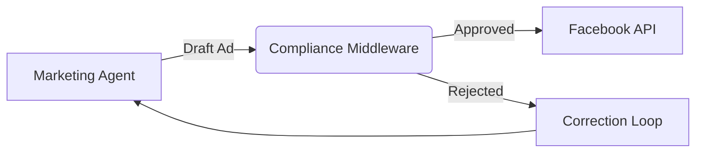

# 🧠 07. Compliance & Risk Management System

**Status:** Draft
**Date:** December 2025
**Objective:** Automated risk mitigation to prevent platform bans (Stripe, Meta, TikTok) and legal liability.

## 1. The Problem
Autonomous agents can inadvertently violate platform policies or laws.
*   **Risk 1:** Trademark Infringement (listing "Nike" knockoffs).
*   **Risk 2:** Ad Policy Violations (False health claims, "Before/After" images).
*   **Risk 3:** Brand Reputation (AI hallucinating offensive replies).

## 2. The Solution: Middleware Interceptors

Instead of asking every agent to "be careful", we wrap their outputs in a **Compliance Middleware**. Nothing goes public without passing through this layer.

### 2.1 Architecture: The Gatekeeper Pattern



### 2.2 Database Schema

#### `compliance_rules` Table
```sql
CREATE TABLE compliance_rules (
  id SERIAL PRIMARY KEY,
  category VARCHAR(50),      -- 'TRADEMARK', 'AD_POLICY', 'PROFANITY'
  pattern TEXT NOT NULL,     -- Regex or Keyword
  severity VARCHAR(20),      -- 'BLOCK', 'WARNING'
  platform VARCHAR(50)       -- 'ALL', 'META', 'TIKTOK'
);
```
*Example Data:*
*   `TRADEMARK`, `Nike|Adidas|Disney`, `BLOCK`, `ALL`
*   `AD_POLICY`, `Cures Cancer|Lose 10lbs fast`, `BLOCK`, `META`

#### `audit_log` Table
```sql
CREATE TABLE audit_log (
  id SERIAL PRIMARY KEY,
  agent_name VARCHAR(50),
  action_type VARCHAR(50),   -- 'PUBLISH_AD', 'SEND_EMAIL'
  content_hash VARCHAR(64),
  status VARCHAR(20),        -- 'APPROVED', 'BLOCKED'
  violation_reason TEXT,
  created_at TIMESTAMP DEFAULT NOW()
);
```

## 3. The Compliance Logic

The `ComplianceService` exposes a `validate(content, context)` method.

### 3.1 Text Analysis (Regex + LLM)
1.  **Fast Check:** Run content against `compliance_rules` (Regex).
2.  **Deep Check:** If context is sensitive (e.g., Health niche), ask LLM:
    *   *Prompt:* "Does this text violate Meta's Advertising Standards regarding Personal Health? Answer YES/NO."

### 3.2 Image Analysis (Future)
*   Use Vision API to detect:
    *   Nudity/Violence (Safety).
    *   Logos (Trademark).
    *   Text-in-image violations.

## 4. Implementation Plan

### Phase 1: The Filter
1.  Create `compliance_rules` table and seed with common banned words.
2.  Implement `ComplianceService.validateText(text)`.

### Phase 2: Integration
1.  **Marketing:** Wrap `AdGenerator.publish()` with `validateText`.
2.  **Product:** Wrap `ProductImporter.import()` to check titles against Trademark list.

### Phase 3: The Feedback Loop
1.  If an action is blocked, return the `violation_reason` to the Agent.
2.  Agent uses this feedback to regenerate compliant content.
    *   *Agent:* "Oops, I can't say 'Cure'. I will rewrite it as 'Support wellness'."
