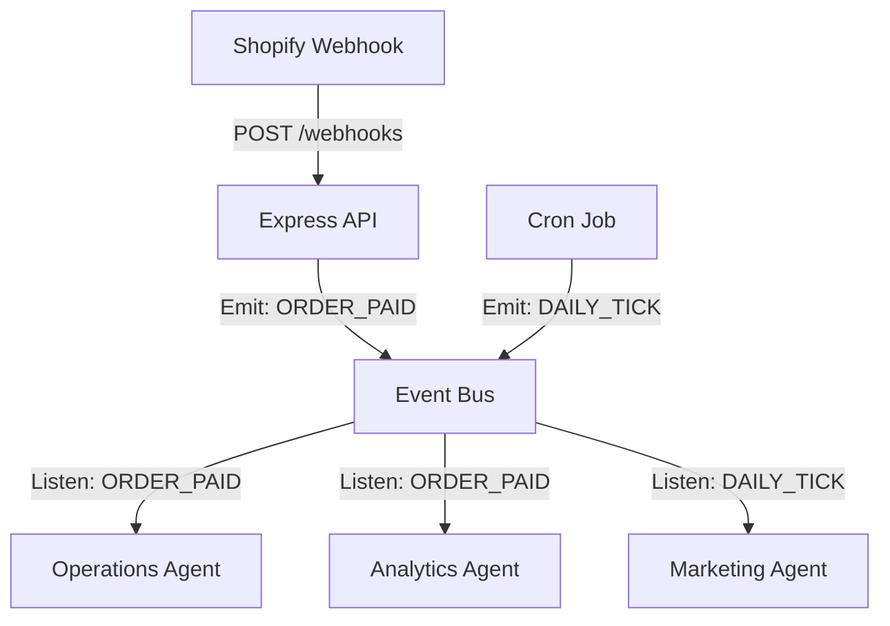

# 🧠 Deep Think: Event-Driven Architecture (EDA)

**Status:** Draft
**Date:** December 2025
**Objective:** Decouple the Agent Swarm from the synchronous `simulation.js` loop to support Real-Time Events (Webhooks).

## 1. The Problem
Currently, `simulation.js` runs like a turn-based game:
1.  Research
2.  Source
3.  Build
4.  Market
5.  Wait for Orders

**Why this fails in Live Mode:**
*   **Webhooks are Async:** Shopify sends an `orders/create` webhook whenever a customer buys. We can't tell Shopify "Wait until Step 5".
*   **Blocking:** If the `ProductResearcher` takes 2 minutes to scrape a site, the `CustomerServiceAgent` is frozen and can't reply to chat.
*   **Scalability:** We can't run agents on different servers if they are all tied to one `while(true)` loop.

## 2. The Solution: Central Event Bus

We will introduce a central `EventBus` that Agents subscribe to.

### 2.1 Architecture



### 2.2 Event Schema

Events should be standard JSON objects:

```json
{
  "eventId": "evt_12345",
  "type": "ORDER_PAID",
  "timestamp": "2025-12-04T12:00:00Z",
  "payload": {
    "orderId": "1001",
    "amount": 49.99,
    "customer": { "email": "bob@example.com" }
  },
  "source": "shopify_webhook"
}
```

### 2.3 Core Events

| Event Name | Trigger | Subscriber(s) | Action |
| :--- | :--- | :--- | :--- |
| `ORDER_PAID` | Shopify Webhook | `OperationsAgent` | Fulfill order. |
| `ORDER_PAID` | Shopify Webhook | `AnalyticsAgent` | Log revenue. |
| `ORDER_PAID` | Shopify Webhook | `RetentionAgent` | Send "Thank You" email. |
| `TICKET_CREATED` | User Email / Chat | `CustomerServiceAgent` | Analyze & Reply. |
| `INVENTORY_LOW` | Operations Agent | `SupplierAgent` | Reorder stock. |
| `DAILY_TICK` | Cron (Midnight) | `MarketingAgent` | Optimize Ads. |
| `MARKET_CRASH` | Market Event Injector | `CEOAgent` | Panic / Adjust Strategy. |

## 3. Implementation Plan

### Phase 1: Local EventEmitter (Node.js)
For the MVP/Simulation, we use Node's built-in `events` module.

1.  Create `src/lib/eventBus.js`:
    ```javascript
    const EventEmitter = require('events');
    class EventBus extends EventEmitter {}
    module.exports = new EventBus();
    ```
2.  Refactor Agents to `listen()` instead of being called.
    *   *Old:* `await operationsAgent.fulfillOrders()`
    *   *New:* `eventBus.on('ORDER_PAID', (data) => operationsAgent.handleOrder(data))`

### Phase 2: Redis (Production)
When we deploy to the cloud, we replace `EventEmitter` with **Redis Pub/Sub**. This allows Agents to run as separate microservices (Docker containers).

## 4. Migration Strategy

1.  **Hybrid Mode:** Keep `simulation.js` for the "Daily Tick" (Time advancement).
2.  **Refactor Operations:** Move Order Fulfillment to be purely event-driven first.
3.  **Refactor CS:** Move Ticket handling to be event-driven second.
4.  **Full Switch:** Remove the loop and rely entirely on Events + Cron.
