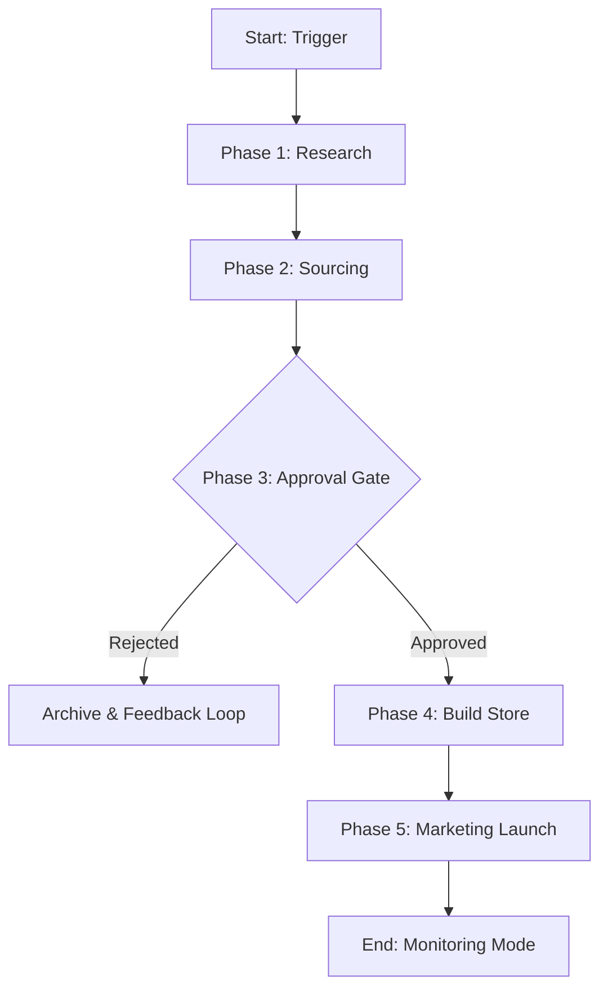

# 🚀 Workflow 1: The Growth Engine (Product Launch)

**Objective:** To systematically identify high-potential products, validate their unit economics, and bring them to market with a live ad campaign.
**Trigger:** Scheduled (Daily at 08:00 AM) OR Manual Command (`"Launch a new product in the Pet niche"`).
**Owner:** CEO Agent (Orchestrator)

---

## 📊 Workflow Diagram

---

## 📝 Detailed Steps

### Phase 1: Opportunity Detection
*   **Actor:** `ProductResearchAgent`
*   **Input:** Niche/Category (optional), Trend Data (Google/TikTok).
*   **Actions:**
    1.  **Scan Trends:** Identify rising keywords (e.g., "heated neck massager").
    2.  **Competitor Analysis:** Check Amazon Best Sellers and Facebook Ad Library.
    3.  **Validation:** Ensure the product solves a problem and has a "Wow" factor.
*   **Output:** `ProductCandidate` Object
    *   `name`: "Smart Neck Massager"
    *   `competitor_price`: $49.99
    *   `saturation_score`: Medium

### Phase 2: Feasibility & Sourcing
*   **Actor:** `SupplierAgent`
*   **Input:** `ProductCandidate`
*   **Actions:**
    1.  **Supplier Search:** Query AliExpress/CJ Dropshipping for matching items.
    2.  **Vetting:** Filter by Rating > 4.5 and Shipping < 15 days.
    3.  **Cost Analysis:** Calculate COGS (Cost of Goods Sold) + Shipping.
*   **Output:** `SourcingReport`
    *   `supplier_link`: "aliexpress.com/item/..."
    *   `unit_cost`: $12.50
    *   `shipping_cost`: $4.00
    *   `total_cogs`: $16.50
    *   `potential_margin`: 67% (Selling at $49.99)

### Phase 3: The Green Light (Approval Gate)
*   **Actor:** `CEOAgent` (and **User** in Live Mode)
*   **Input:** `ProductCandidate` + `SourcingReport`
*   **Decision Logic:**
    1.  **Profitability Check:** Is Gross Margin > 30%? ( ($49.99 - $16.50) / $49.99 = 67% ✅ )
    2.  **Risk Check:** Is the supplier reliable?
*   **Approval Process:**
    *   **Mock Mode:** CEO Agent auto-approves if logic passes.
    *   **Live Mode:** CEO Agent pauses and sends a **Notification** to the User (Admin Panel / Email).
        *   *"I found a Neck Massager with 67% margin. Ready to launch? [YES/NO]"*
*   **Outcome:** Proceed to Build OR Archive.

### Phase 4: Asset Creation
*   **Actor:** `StoreBuildAgent`
*   **Input:** Approved Product Data
*   **Actions:**
    1.  **Copywriting:** Generate persuasive title, description, and benefits using LLM.
    2.  **Image Processing:** Fetch supplier images, remove watermarks, upscale (TinyPNG).
    3.  **Platform Push:** Create Product in Shopify (via API).
*   **Output:** `ProductPage`
    *   `url`: "myshop.com/products/smart-neck-massager"
    *   `status`: Active

### Phase 5: Go-to-Market (Launch)
*   **Actor:** `MarketingAgent`
*   **Input:** `ProductPage`
*   **Actions:**
    1.  **Creative Gen:** Generate Ad Copy ("Stop Neck Pain Today!") and select best images.
    2.  **Targeting:** Define audience (e.g., "Interests: Yoga, Office Workers").
    3.  **Campaign Setup:** Create Campaign in Meta Ads Manager.
    4.  **Budgeting:** Set initial test budget (e.g., $50/day).
*   **Output:** `AdCampaign`
    *   `id`: "123456789"
    *   `status`: "In Review"

---

## 🚦 Exception Handling

| Scenario | Action |
| :--- | :--- |
| **No Products Found** | `ProductResearchAgent` waits 6 hours and retries with a broader category. |
| **Margin Too Low** | `CEOAgent` rejects the candidate. `SupplierAgent` logs the failure to avoid retrying the same item. |
| **API Error (Shopify)** | `StoreBuildAgent` retries 3 times, then alerts User via "Critical Ticket". |
| **Ad Rejected** | `MarketingAgent` reads the rejection reason, modifies the copy (Compliance Check), and re-submits. |
