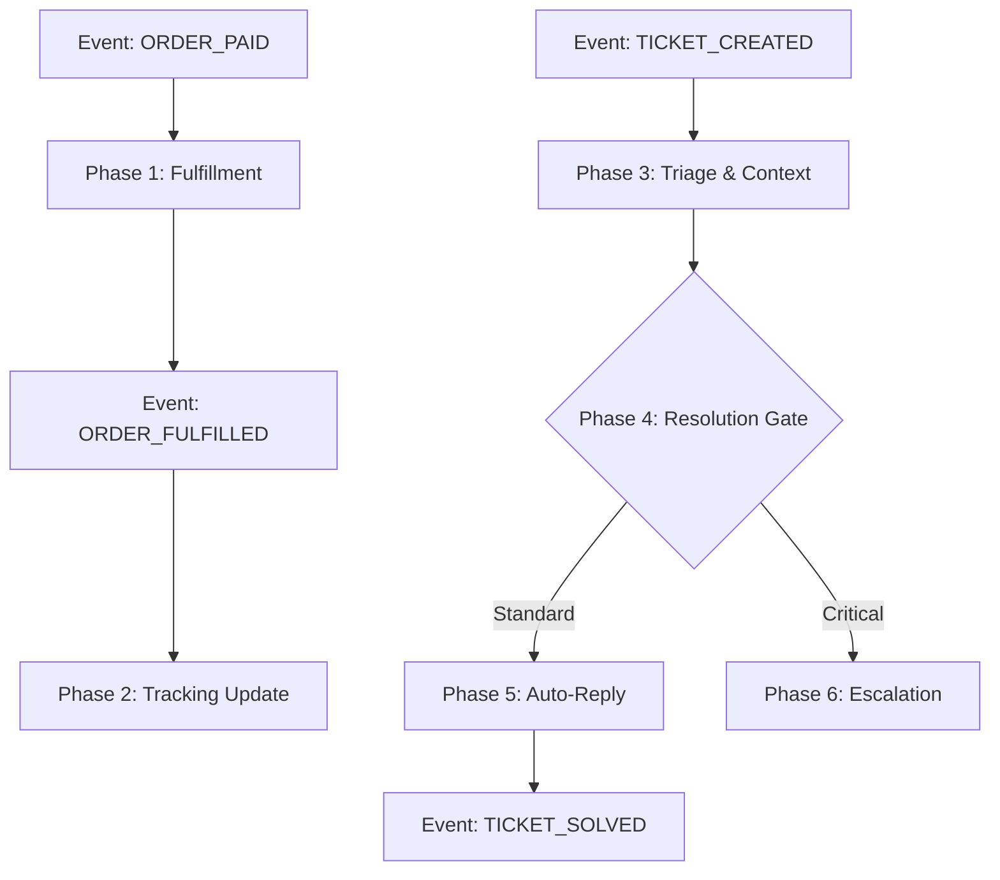

# 🛡️ Workflow 2: The Operations Engine (Defense)

**Objective:** To fulfill customer promises, resolve issues instantly, and maintain business continuity without human intervention.
**Trigger:** External Webhooks (Shopify, Stripe, Email) or Internal Alerts.
**Owner:** Operations Agent (Logistics) & Customer Service Agent (Support)

---

## 📊 Workflow Diagram

---

## 📝 Detailed Steps & Technical Actions

### Phase 1: Order Fulfillment (Instant)
*   **Actor:** `OperationsAgent`
*   **Trigger Event:** `ORDER_PAID` (from Shopify Webhook)
*   **MCP Tools / Actions:**
    *   `shopify.get_order(order_id)`: Fetch shipping address and line items.
    *   `supplier_api.place_order(details)`: Purchase item from AliExpress/CJ.
    *   `db.log_transaction(type="COGS", amount)`: Record the cost in the ledger.
*   **Logic:**
    1.  **Validation:** Check if address is valid and stock exists.
    2.  **Purchase:** Automatically buy the item from the supplier using the customer's address.
    3.  **Financials:** Log the expense immediately to track real-time profit.
*   **Output Event:** `SUPPLIER_ORDER_PLACED`
    *   **Payload:** `{ "shopify_order_id": "1001", "supplier_order_id": "ali_555", "cost": 12.50 }`

### Phase 2: Tracking Synchronization (Async)
*   **Actor:** `OperationsAgent`
*   **Trigger Event:** `SUPPLIER_SHIPPED` (Polled or Webhook from Supplier)
*   **MCP Tools / Actions:**
    *   `shopify.fulfillment_create(order_id, tracking_number)`: Mark order as fulfilled.
    *   `email_service.send_shipping_confirmation(customer_email)`: Notify customer.
*   **Logic:**
    1.  **Sync:** When supplier provides a tracking number, push it to Shopify.
    2.  **Notify:** Trigger the "Your Order is on the Way" email.
*   **Output Event:** `ORDER_FULFILLED`

### Phase 3: Support Triage & Context
*   **Actor:** `CustomerServiceAgent`
*   **Trigger Event:** `TICKET_CREATED` (Email or Chat)
*   **MCP Tools / Actions:**
    *   `ticket_db.get_history(customer_email)`: Fetch past conversations.
    *   `shopify.get_customer_orders(email)`: Check if they are a VIP or first-time buyer.
    *   `llm.analyze_sentiment(message)`: Score anger level (0-100).
*   **Logic:**
    1.  **Context Building:** "This is John. He bought a Neck Massager 3 days ago. It hasn't shipped yet. He is Angry (85/100)."
    2.  **Intent Recognition:** Is he asking for a Refund, Tracking, or Product Info?
*   **Output Event:** `TICKET_TRIAGED`
    *   **Payload:** `{ "ticket_id": "t_123", "intent": "refund_request", "sentiment": "angry", "priority": "high" }`

### Phase 4: Resolution Gate
*   **Actor:** `CustomerServiceAgent`
*   **Trigger Event:** `TICKET_TRIAGED`
*   **Logic:**
    *   **Standard:** "Where is my order?" -> Auto-Reply with tracking.
    *   **Critical:** "This product burned my neck!" -> Escalate to Human.
    *   **Refunds:** If < $20 and "Damaged", Auto-Refund. If > $50, Escalate.

### Phase 5: Auto-Reply (Standard)
*   **Actor:** `CustomerServiceAgent`
*   **Trigger Event:** `TICKET_TRIAGED` (if Standard)
*   **MCP Tools / Actions:**
    *   `llm.generate_reply(context, policy)`: Draft polite response.
    *   `helpdesk.send_reply(ticket_id, body)`: Send email/chat.
    *   `ticket_db.update_status(ticket_id, "solved")`: Close ticket.
*   **Output Event:** `TICKET_SOLVED`

### Phase 6: Escalation (Critical)
*   **Actor:** `CEOAgent` (Notification)
*   **Trigger Event:** `TICKET_ESCALATED`
*   **MCP Tools / Actions:**
    *   `admin_panel.send_alert(message, level="critical")`: Push notification to User phone.
    *   `slack.post_message(channel="#urgent", text)`: Notify team.
*   **Logic:**
    1.  **Freeze:** If multiple reports of "Burning", pause the Ad Campaign immediately (`CAMPAIGN_PAUSED`).
    2.  **Alert:** Wake up the human user.

---

## 🚦 Exception Handling

| Scenario | Trigger Event | Handler Agent | Action |
| :--- | :--- | :--- | :--- |
| **Supplier Out of Stock** | `ORDER_FAILED` | `OperationsAgent` | Find backup supplier. If none, email customer offering refund or wait. |
| **Invalid Address** | `ADDRESS_INVALID` | `CustomerServiceAgent` | Auto-email customer: "Please correct your address." |
| **Tracking Stuck** | `SHIPPING_DELAYED` | `OperationsAgent` | If > 10 days no movement, auto-refund or reship. |
| **Payment Dispute** | `CHARGEBACK_CREATED` | `OperationsAgent` | Auto-submit tracking proof to Stripe/PayPal via API. |
