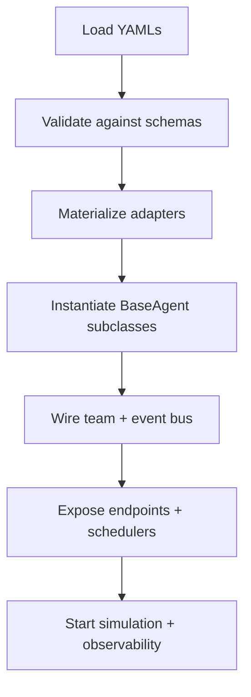
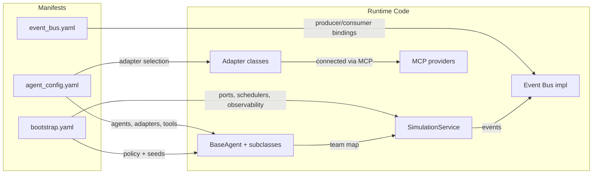

# Agent spin-up flow: YAML inputs vs runtime interactions

This document explains what happens when agents are spun up in the ds1 single-container runtime. It separates what is supplied by YAML manifests from what is provided by existing runtime code, and shows how these pieces connect when the app boots.

## Key inputs
- **Agent manifest** (`Documentation/Blueprints/agent_config.yaml`): agent roles, adapters, tools, events, memory, outputs, boot order, and HTTP exposure.
- **Event manifest** (`Documentation/Blueprints/event_bus.yaml`): event definitions, producers/consumers, routing, QoS, retries/DLQs, security, and observability.
- **Bootstrap manifest** (e.g., `Documentation/Blueprints/bootstrap.yaml` or environment overlay): ports, ingress endpoints, schedulers, feature flags, AI policies, seeds, observability, security, lifecycle hooks, and testing profiles.

## High-level sequence

## What comes from YAML
- **Adapter choices and modes**: which adapter class to use for DB, shop, ads, trends, research, fulfilment, email, and AI; mode selection (live/test/mock); adapter-level configs (API keys, rate limits, retries).
- **Agent registry**: which agents are active, their IDs, roles, tools, event subscriptions, memory sources, outputs, HTTP exposure, and boot ordering.
- **Event contracts**: event names/categories, payload schemas, producers/consumers, topics/filters, error handling (retries, DLQ), security (auth, redaction), and SLAs.
- **Runtime toggles**: feature flags, schedules/cron ticks, ingress endpoints, ports, observability settings (logs/metrics/tracing), AI policy defaults, and seed data.

## What runtime code supplies
- **Class implementations**: `BaseAgent` behaviors (`log`, `handleMessage`, tool execution tracing) plus concrete subclasses (`CEOAgent`, `ProductResearchAgent`, `SupplierAgent`, `StoreBuildAgent`, `MarketingAgent`, `CustomerServiceAgent`, `OperationsAgent`, `AnalyticsAgent`).
- **Adapter classes**: implementations already used in `src/index.ts` (e.g., `PostgresAdapter`, `MockAdapter`, `LiveShopAdapter`, `TestShopAdapter`, `MockShopAdapter`, `LiveAdsAdapter`, `TestAdsAdapter`, `MockAdsAdapter`, `LiveTrendAdapter`, `MockTrendAdapter`, `LiveCompetitorAdapter`, `MockCompetitorAdapter`, `LiveFulfilmentAdapter`, `MockFulfilmentAdapter`, `LiveEmailAdapter`, `MockEmailAdapter`, `LiveAiAdapter`, `MockAiAdapter`).
- **Orchestration glue**: `SimulationService` wiring of the agent map and DB adapter; `configService` defaults that the loader may override with YAML; Express app setup for public assets; the event bus implementation (in-process now, Redis later).
- **MCP integration**: MCP providers/tools that allow adapters to reach external ports/endpoints; the YAML only selects which MCP-backed provider to bind.

## Detailed boot flow
1. **Load & validate manifests**
   - Read the agent, event, and bootstrap YAMLs; validate against JSON Schemas to ensure required fields (e.g., `agents[*].adapters.db`, `events[*].contracts.consumers`).
   - Apply environment overlays (e.g., `bootstrap.simulation.yaml`) to override modes/secrets without code edits.

2. **Materialize adapters**
   - Build an adapter registry from YAML entries and map each logical adapter to its concrete class from the runtime list above.
   - Instantiate adapters with YAML-provided config (keys, hosts, rate limits) and default to `configService` values when omitted.

3. **Instantiate agents**
   - Look up each YAML-declared agent ID and construct its `BaseAgent` subclass with the resolved adapters.
   - Apply YAML roles, tools, memory bindings, and output routes; agents inherit logging and tool tracing from `BaseAgent`.

4. **Wire team and simulation**
   - Call `setTeam` on `CEOAgent` with the full agent map, mirroring the existing `src/index.ts` pattern.
   - Initialize `SimulationService` with the agent map and DB adapter so the simulation loop runs with YAML-driven dependencies.

5. **Bind events and endpoints**
   - Register producers/consumers from `event_bus.yaml` on the in-process event bus; honor routing filters, retries, DLQs, and security directives from the manifest.
   - Expose HTTP endpoints and webhook ingress declared in YAML via Express; attach schedulers/cron ticks from the bootstrap manifest.
   - Route port/endpoints through MCP providers specified in YAML so external interactions stay declarative.

6. **Start observability and policies**
   - Enable logging/metrics/tracing per the bootstrap manifest; apply AI policy defaults (safety, model choice, rate limits) before agents begin emitting events.

## Traceability diagram

## What still requires code changes
- **New adapter implementations**: if a required provider is not already in the adapter list above, you must add the class before YAML can reference it.
- **New agent types**: adding an agent not covered by current subclasses requires implementing the class and registering it with the loader.
- **Non-configurable behaviors**: any orchestration logic not exposed in YAML (e.g., new lifecycle hooks) needs runtime code updates to become declarative.

With this flow, the application can be started from YAML manifests while reusing existing agent/adapters, the simulation loop, MCP plumbing, and event bus code.
