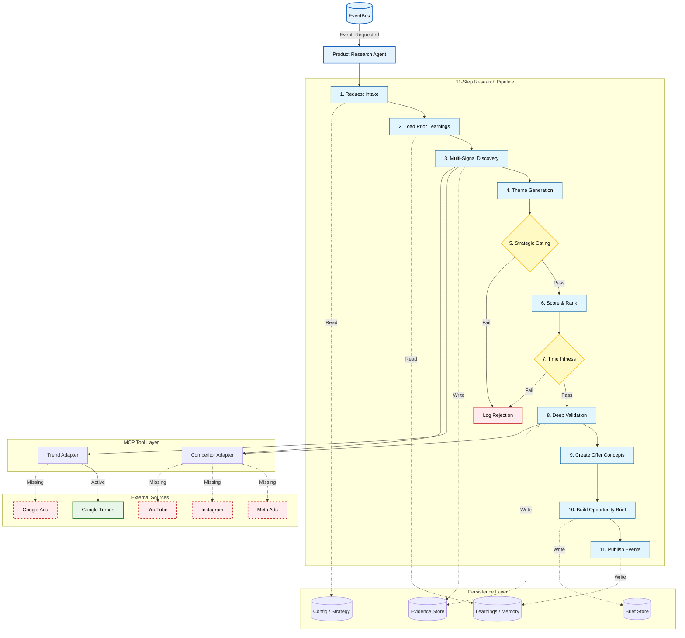

# Product Research Agent — MVP Block Diagram

```mermaid
flowchart TB
  %% Core Components
  EB[(EventBus)]
  PRA[Product Research Agent]

  %% Flow Connections
  EB -->|Event: Requested| PRA

  %% 11-Step Pipeline
  subgraph Pipeline [11-Step Research Pipeline]
    direction TB
    S1[1. Request Intake]
    S2[2. Load Prior Learnings]
    S3[3. Multi-Signal Discovery]
    S4[4. Theme Generation]
    S5{5. Strategic Gating}
    S6[6. Score & Rank]
    S7{7. Time Fitness}
    S8[8. Deep Validation]
    S9[9. Create Offer Concepts]
    S10[10. Build Opportunity Brief]
    S11[11. Publish Events]

    S1 --> S2 --> S3 --> S4 --> S5
    S5 -->|Pass| S6 --> S7
    S7 -->|Pass| S8 --> S9 --> S10 --> S11
    S5 -->|Fail| Reject[Log Rejection]
    S7 -->|Fail| Reject
  end

  PRA --> S1

  %% Data Stores
  subgraph STORES [Persistence Layer]
    CS[(Config / Strategy)]
    EM[(Learnings / Memory)]
    ES[(Evidence Store)]
    BS[(Brief Store)]
  end

  S1 -.->|Read| CS
  S2 -.->|Read| EM
  S11 -.->|Write| EM
  S3 -.->|Write| ES
  S8 -.->|Write| ES
  S10 -.->|Write| BS

  %% MCP Layer
  subgraph MCP [MCP Tool Layer]
    TA[Trend Adapter]
    CA[Competitor Adapter]
  end

  S3 --> TA
  S3 --> CA
  S8 --> CA

  %% External Sources (Color Coded for Status)
  subgraph EXT [External Sources]
    GT[Google Trends]
    GADS[Google Ads]
    FB[Meta Ads]
    IG[Instagram]
    YT[YouTube]
  end

  TA -->|Active| GT
  TA -.->|Missing| GADS
  CA -.->|Missing| FB
  CA -.->|Missing| IG
  CA -.->|Missing| YT

  %% Styling
  classDef actor fill:#e3f2fd,stroke:#1565c0,stroke-width:2px,color:black;
  classDef step fill:#e1f5fe,stroke:#01579b,color:black;
  classDef decision fill:#fff9c4,stroke:#fbc02d,stroke-width:2px,color:black;
  classDef fail fill:#ffebee,stroke:#c62828,stroke-width:2px,color:black;
  classDef active fill:#e8f5e9,stroke:#2e7d32,stroke-width:2px,color:black;
  classDef missing fill:#ffebee,stroke:#c62828,stroke-width:2px,stroke-dasharray: 5 5,color:black;

  class EB,PRA actor;
  class S1,S2,S3,S4,S6,S8,S9,S10,S11 step;
  class S5,S7 decision;
  class Reject fail;
  class GT active;
  class GADS,FB,IG,YT missing;
```
