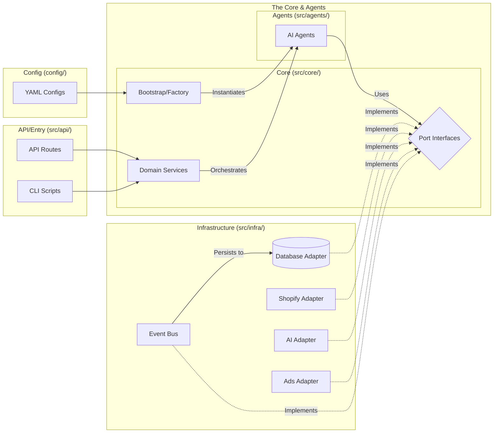

# Architecture Reference

This document serves as the source of truth for the mapping between the YAML configuration files and the actual TypeScript classes in the codebase.

## 1. System Overview

The system follows a Hexagonal Architecture (Ports & Adapters) pattern, orchestrated by a central `Container` or `ServiceFactory` (located in `src/core/bootstrap/`).

### Architecture Diagram

This diagram maps the project folder structure to the Hexagonal Architecture flow:

- **Config**: `config/` (YAML files define which adapters to load)
- **Core**: `src/core/` (Domain logic, Ports interfaces, Services, Bootstrap)
- **Agents**: `src/agents/` (AI Agents implementing core logic)
- **Infrastructure**: `src/infra/` (Adapters implementing Ports)
- **API/Entry**: `src/api/` & `src/index.ts` (Entry points)

## 2. Agent Mapping

Agents are defined in `config/agents.yaml` and instantiated in `src/wiring/ServiceFactory.ts` (or `Container.ts`).

| Agent Role | YAML Key | Class Name | File Path |
| :--- | :--- | :--- | :--- |
| **CEO** | `ceo` | `CEOAgent` | [src/agents/CEOAgent.ts](src/agents/CEOAgent.ts) |
| **Analytics** | `analytics` | `AnalyticsAgent` | [src/agents/AnalyticsAgent.ts](src/agents/AnalyticsAgent.ts) |
| **Product Research** | `research` | `ProductResearchAgent` | [src/agents/ProductResearchAgent.ts](src/agents/ProductResearchAgent.ts) |
| **Supplier** | `supplier` | `SupplierAgent` | [src/agents/SupplierAgent.ts](src/agents/SupplierAgent.ts) |
| **Store Build** | `store` | `StoreBuildAgent` | [src/agents/StoreBuildAgent.ts](src/agents/StoreBuildAgent.ts) |
| **Marketing** | `marketing` | `MarketingAgent` | [src/agents/MarketingAgent.ts](src/agents/MarketingAgent.ts) |
| **Customer Service** | `customer_service` | `CustomerServiceAgent` | [src/agents/CustomerServiceAgent.ts](src/agents/CustomerServiceAgent.ts) |
| **Operations** | `operations` | `OperationsAgent` | [src/agents/OperationsAgent.ts](src/agents/OperationsAgent.ts) |

> **Note**: The `SimulationService` currently orchestrates a subset of these agents (CEO, Research, Supplier, Store, Marketing, Analytics).

## 3. Infrastructure Adapters (Ports & Adapters)

Adapters are selected based on `config/bootstrap.yaml` (or `bootstrap.live.yaml` / `bootstrap.sim.yaml`).

### Persistence (`PersistencePort`)
| Mode | Class Name | File Path |
| :--- | :--- | :--- |
| `memory` | `MockAdapter` | [src/infra/db/MockAdapter.ts](src/infra/db/MockAdapter.ts) |
| `postgres` | `PostgresAdapter` | [src/infra/db/PostgresAdapter.ts](src/infra/db/PostgresAdapter.ts) |

### Event Bus (`EventBusPort`)
| Mode | Class Name | File Path |
| :--- | :--- | :--- |
| `memory` | `InMemoryEventBus` | [src/infra/events/InMemoryEventBus.ts](src/infra/events/InMemoryEventBus.ts) |
| `postgres` | `PostgresEventBus` | [src/infra/events/PostgresEventBus.ts](src/infra/events/PostgresEventBus.ts) |

> **Note**: `PostgresEventBus` uses `PersistencePort.saveEvent()` to store events in the main database (Postgres or Mock), effectively treating the main DB as the "Event Store".

### Trends Provider (`TrendsPort`)
| Mode | Class Name | File Path |
| :--- | :--- | :--- |
| `simulated` | `MockTrendAdapter` | [src/infra/trends/GoogleTrendsAPI/MockTrendAdapter.ts](src/infra/trends/GoogleTrendsAPI/MockTrendAdapter.ts) |
| `live` | `LiveTrendAdapter` | [src/infra/trends/GoogleTrendsAPI/LiveTrendAdapter.ts](src/infra/trends/GoogleTrendsAPI/LiveTrendAdapter.ts) |

### Shop Platform (`ShopPlatformPort`)
| Mode | Class Name | File Path |
| :--- | :--- | :--- |
| `simulated` | `MockShopAdapter` | [src/infra/shop/MockShopAdapter.ts](src/infra/shop/MockShopAdapter.ts) |
| `shopify` | `LiveShopAdapter` | [src/infra/shop/LiveShopAdapter.ts](src/infra/shop/LiveShopAdapter.ts) |

### Ads Platform (`AdsPlatformPort`)
| Mode | Class Name | File Path |
| :--- | :--- | :--- |
| `simulated` | `MockAdsAdapter` | [src/infra/ads/GoogleAds/MockAdsAdapter.ts](src/infra/ads/GoogleAds/MockAdsAdapter.ts) |
| `google` | `LiveAdsAdapter` | [src/infra/ads/GoogleAds/LiveAdsAdapter.ts](src/infra/ads/GoogleAds/LiveAdsAdapter.ts) |

### AI Provider (`AiPort`)
| Mode | Class Name | File Path |
| :--- | :--- | :--- |
| `simulated` | `MockAiAdapter` | [src/infra/ai/MockAiAdapter.ts](src/infra/ai/MockAiAdapter.ts) |
| `openai` | `LiveAiAdapter` | [src/infra/ai/LiveAiAdapter.ts](src/infra/ai/LiveAiAdapter.ts) |

## 4. Core Services

These services contain the business logic and orchestrate the agents and adapters.

| Service | Class Name | File Path |
| :--- | :--- | :--- |
| **Simulation** | `SimulationService` | [src/core/services/SimulationService.ts](src/core/services/SimulationService.ts) |
| **Config** | `ConfigService` | [src/infra/config/ConfigService.ts](src/infra/config/ConfigService.ts) |
| **Activity Log** | `ActivityLogService` | [src/core/services/ActivityLogService.ts](src/core/services/ActivityLogService.ts) |
| **Research Staging**| `ResearchStagingService`| [src/core/services/ResearchStagingService.ts](src/core/services/ResearchStagingService.ts) |

## 5. API & Entry Points

The system exposes an API for the frontend control panel.

- **Main Entry**: [src/index.ts](src/index.ts) (Express server setup)
- **Routes**:
    - Activity: [src/api/activity-routes.ts](src/api/activity-routes.ts)
    - Briefs: [src/api/brief-routes.ts](src/api/brief-routes.ts)
    - Agents: [src/api/agent-routes.ts](src/api/agent-routes.ts)
    - Admin: [src/api/admin-routes.ts](src/api/admin-routes.ts)

## 6. Configuration Files

- **Agents**: [config/agents.yaml](config/agents.yaml) - Defines agent prompts and capabilities.
- **Bootstrap**: [config/bootstrap.yaml](config/bootstrap.yaml) - Selects which adapters to use (sim vs live).
- **Infrastructure**: [config/infrastructure.yaml](config/infrastructure.yaml) - API keys and connection strings.
