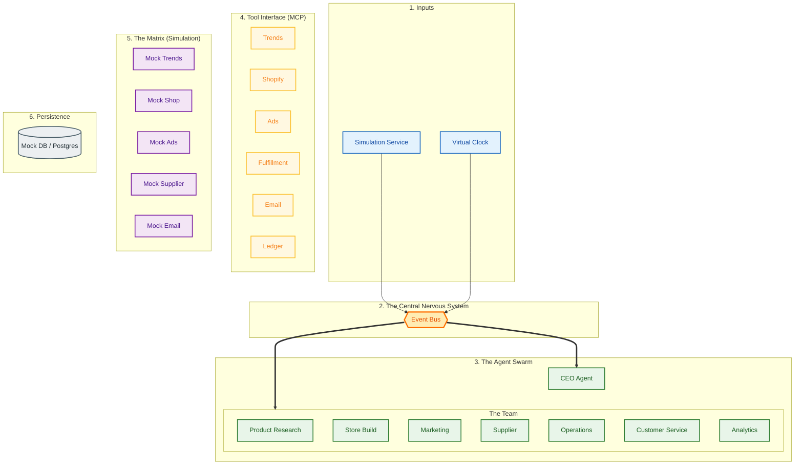

# 🌍 Environments: Simulation vs. Live

**Status:** Active
**Date:** December 2025

This guide explains the **Architectural Symmetry** of the DropShip AI system. The core code (Agents, Event Bus, Logic) is identical in both environments. The only difference is the **Configuration** (Adapters & Database).

## 1. The Core Principle: Symmetry

We do not write "Simulation Code" and "Live Code". We write **One System** that runs in two modes.

| Feature | Simulation Mode (`npm run sim`) | Live Mode (`npm start`) |
| :--- | :--- | :--- |
| **Trigger** | `SimulationService` (Scripted Loop) | `Express` (Webhooks/User Input) |
| **Database** | `MockAdapter` (In-Memory/Reset) | `PostgresAdapter` (Persistent) |
| **Shopify** | `MockShopAdapter` | `LiveShopAdapter` |
| **Trends** | `MockTrendAdapter` | `LiveTrendAdapter` |
| **Ads** | `MockAdsAdapter` | `LiveAdsAdapter` |
| **AI** | `MockAiAdapter` | `LiveAiAdapter` |
| **Time** | `VirtualClock` (1 hour = 1 second) | `RealTime` (System Clock) |

## 2. Architecture Diagrams

### 2.1 Simulation Mode (The "Game")
In this mode, the system runs in a closed loop. The `SimulationService` acts as the "Game Master," injecting events (like "Customer Placed Order") to test how Agents react.

### 2.2 Live Mode
In Live Mode, the `SimulationService` is disabled. The system reacts to real-world events (Webhooks from Shopify, User clicks in Control Panel).

- **Adapters**: Swapped from `Mock*` to `Live*`.
- **Database**: Swapped from `MockAdapter` to `PostgresAdapter`.
- **AI**: Swapped from `MockAiAdapter` (canned responses) to `LiveAiAdapter` (OpenAI GPT-4).
