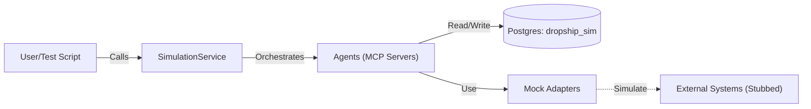
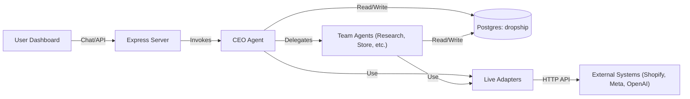
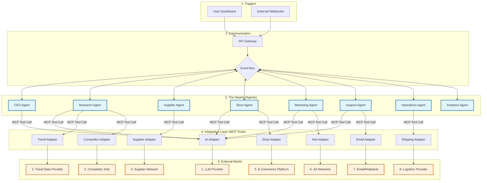

# Simulation vs. Live Environments

This guide summarizes how DS1 behaves in **simulation** (mock, single-container) versus **live** (real integrations) modes so operators and AI agents can load the right YAML manifests, adapters, and operational controls at boot.

## Overview

- **Simulation:** Fast, deterministic, self-contained. Uses mock adapters, local JSON data, and the in-process event emitter for experimentation and development.
- **Live:** Production-facing. Uses real commerce/ads endpoints, hosted data stores, and hardened observability/security defaults.

### Architecture diagrams

**Simulation (Script-Driven)**

In simulation, the `SimulationService` acts as the "Game Engine," driving the agents through a predefined script.

**Live (Event/User-Driven)**

In live mode, the system is reactive. Agents respond to User Chat commands.

## Configuration Sources

| Area | Simulation | Live |
| --- | --- | --- |
| Adapter selection | `mode: mock` for shop, ads, trends, competitor, fulfilment, email, AI | `mode: live` with real credentials and API rate policies |
| Data stores | Postgres (`dropship_sim`) | Postgres (`dropship`) with backups |
| Event bus transport | In-process Node `EventEmitter` (per `event_bus.yaml`) | In-process Node `EventEmitter` (same as simulation for now) |
| Secrets | Inline defaults or `.env.example` placeholders | Vaulted secrets, rotated keys, webhook signatures enforced |
| Observability | Console logs, lightweight metrics | Structured logs, tracing, alerting SLOs |
| Feature flags | Simulation defaults in bootstrap overlays | Environment overrides for risky features |
| Seeding | YAML seeds for products/campaigns/tickets | No seeds; relies on live data imports |

## Runtime Behavior

- **Boot flow:** Both environments read the same YAMLs; `bootstrap.<env>.yaml` overlays swap adapter modes, endpoints, seeds, and secrets before wiring agents.
- **Traffic:** Simulation uses deterministic traffic parameters and mock carts; live listens to real webhooks (e.g., `ORDER_PAID`) and ad platforms.
- **Latency & retries:** Live enables exponential backoff, DLQs, and idempotency on writes. Simulation favors speed and may skip durability.
- **AI usage:** Simulation can cap token budgets and use local fixtures for prompts; live honors production rate limits and safety filters.
- **Failure handling:** Simulation treats failures as debugging signals; live activates circuit breakers, compensating actions, and alerts.

## Integration Surface

- **Ports/endpoints:**
  - Simulation: mock adapters emulate shop/ads/trends/competitor/fulfilment/email ports; endpoints are stubbed or disabled.
  - Live: actual HTTP/IMAP/webhook endpoints are bound.
- **Event contracts:** Same event names, but live enforces payload validation, signature checks, and PII redaction at ingress.

## Deployment & Operations

- **Topology:** Simulation remains single-container by default. Live can fan out agents and the event bus (Redis/pub-sub) across replicas.
- **Observability hooks:** Live mode should emit metrics/logs/traces to centralized sinks; simulation can keep local-only telemetry.
- **Change management:** Apply new YAML manifests to a staging overlay before promoting to live. Keep drift checks between `event_bus.yaml`, `agent_config.yaml`, and runtime state.

## What stays the same

- Agent roles, event names, and contracts are consistent across environments.
- YAML-driven bootstrap and agent definitions remain the source of truth; only overlays change between simulation and live.
- **File naming caution:** Any files that reference "simulation" (including shared helpers or overlays) may still be read during
  live execution. Keep them production-safe (no test secrets or debug-only logic) and document the expected live usage to avoid
  accidental drift.

## Quick checklist

- Select the correct bootstrap overlay (`bootstrap.simulation.yaml` vs. `bootstrap.live.yaml`).
- Verify adapter modes and credentials match the target environment.
- Enable appropriate observability, DLQ, and retry settings for live.
- Confirm MCP providers are bound to the right ports/endpoints.
- Run smoke tests in simulation before promoting manifests to live.

## Target Architecture (Future Vision)

This diagram represents the **ideal state** where the Event Bus is fully decoupled, Webhooks drive the system, and Agents communicate asynchronously.

