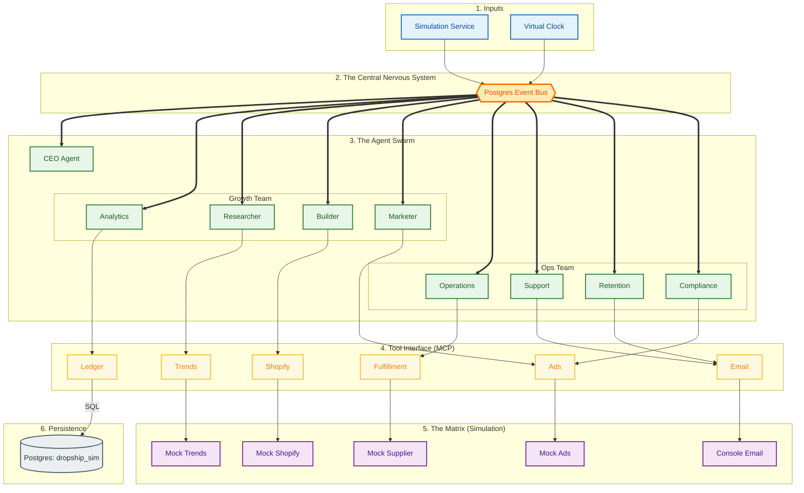
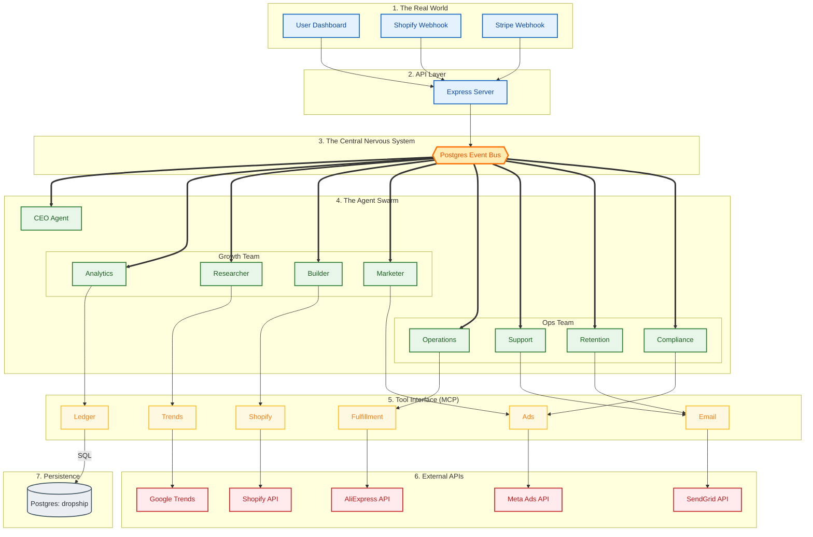

# 🌍 Environments: Simulation vs. Live

**Status:** Active
**Date:** December 2025

This guide explains the **Architectural Symmetry** of the DropShip AI system. The core code (Agents, Event Bus, Logic) is identical in both environments. The only difference is the **Configuration** (Adapters & Database).

## 1. The Core Principle: Symmetry

We do not write "Simulation Code" and "Live Code". We write **One System** that runs in two modes.

| Feature | Simulation Mode (`npm run sim`) | Live Mode (`npm start`) |
| :--- | :--- | :--- |
| **Trigger** | `SimulationService` (Scripted Loop) | `Express` (Webhooks/User Input) |
| **Database** | `dropship_sim` (Reset on boot) | `dropship` (Persistent) |
| **Adapters** | `MockShopify`, `MockOpenAI` | `ShopifyAdapter`, `OpenAIAdapter` |
| **Time** | `VirtualClock` (1 hour = 1 second) | `RealTime` (System Clock) |
| **Money** | Monopoly Money (Tracked in Ledger) | Real USD (Stripe/Bank) |

## 2. Architecture Diagrams

### 2.1 Simulation Mode (The "Game")
In this mode, the system runs in a closed loop. The `SimulationService` acts as the "Game Master," injecting events (like "Customer Placed Order") to test how Agents react.

### 2.2 Live Mode (The "Business")
In this mode, the system waits for the real world. It reacts to Webhooks (Shopify, Stripe) or User Commands (Dashboard).

## 3. Configuration Differences

The environment is controlled by the `bootstrap.yaml` configuration (or `.env` overrides).

### 3.1 Infrastructure
*   **Event Bus:** Both use `PostgresEventStore`.
    *   *Sim:* Polls frequently or uses in-memory dispatch for speed.
    *   *Live:* Uses reliable polling/subscriptions.
*   **Database:**
    *   *Sim:* `DROP SCHEMA public CASCADE` on boot. Seeds with `sandbox_db.json` data.
    *   *Live:* Never drops data. Migrations only.

### 3.2 Adapters (The Interface Layer)

| Adapter | Simulation Implementation | Live Implementation |
| :--- | :--- | :--- |
| **Shop** | `InMemoryShop`: Stores products in RAM/DB. | `ShopifyAdapter`: Calls Shopify Admin API. |
| **Marketing** | `MockAds`: Returns fake CPC/CTR data. | `MetaAdsAdapter`: Calls Facebook Marketing API. |
| **Email** | `ConsoleEmail`: Prints email to terminal. | `SendGridAdapter`: Sends real emails. |
| **Research** | `MockTrends`: Returns static trend data. | `GoogleTrendsAdapter`: Scrapes real trends. |
| **Payment** | `MockStripe`: Always succeeds. | `StripeAdapter`: Processes real cards. |

## 4. Data Flow & Persistence

### 4.1 The "Reset" Button
*   **Simulation:** Designed to be destroyed. You can run `npm run sim` 100 times a day. It wipes the `dropship_sim` database every time to ensure a clean state.
*   **Live:** Designed to be eternal. The `dropship` database is the "Source of Truth" for the business.

### 4.2 Logging
*   **Simulation:** Logs to `console` and `activity_log` table for debugging.
*   **Live:** Logs to `activity_log` for audit trails and potentially external monitoring (Datadog/Sentry).

## 5. Development Workflow

1.  **Code:** Write a new Agent or Feature.
2.  **Test (Sim):** Run `npm run sim`. Watch the agent interact with Mock Adapters.
    *   *Verify:* Did it handle the "Order Paid" event correctly?
    *   *Verify:* Did it update the Ledger?
3.  **Deploy (Live):** Push to production.
    *   *Config:* Switch `ENV=production`.
    *   *Result:* The exact same code now listens to real Shopify webhooks.

## 6. Safety Guardrails

To prevent "Skynet" scenarios (e.g., spending $10k on ads by mistake), Live Mode has strict limits:
*   **Budget Caps:** Hard limits on Ad Spend per day.
*   **Rate Limits:** API calls are throttled.
*   **Human-in-the-Loop:** Sensitive actions (like "Delete Product" or "Publish Ad Campaign") may require Dashboard approval.
