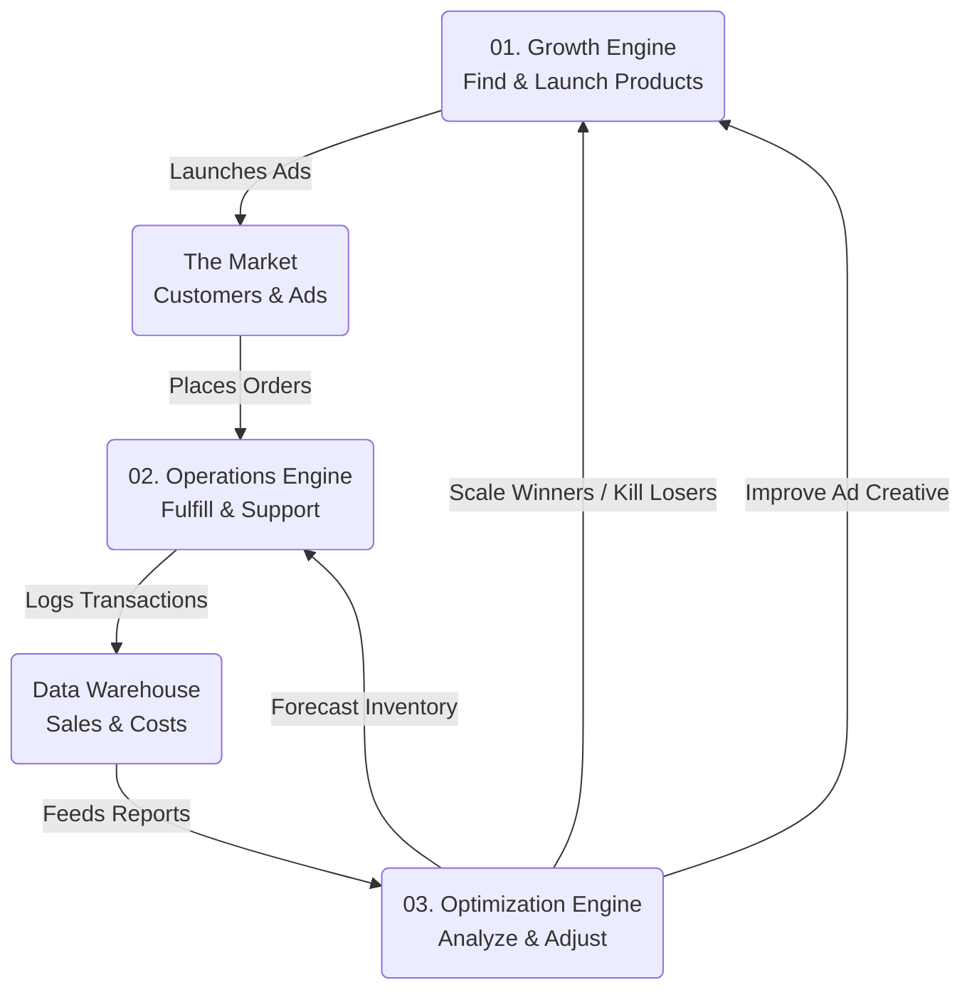

# 🔄 The Autonomous Business Flywheel

The DropShip AI system operates on three interconnected workflows that form a continuous feedback loop. This "Flywheel" ensures that the business not only runs but improves over time.

## 🧩 The Three Engines

| Sequence | Engine | Role | Metaphor | Input | Output |
| :--- | :--- | :--- | :--- | :--- | :--- |
| **01** | [**Growth**](./01_GROWTH.md) | **Offense** | The Hunter | Market Trends | Active Ad Campaigns |
| **02** | [**Operations**](./02_OPERATIONS.md) | **Defense** | The Steward | Customer Orders | Happy Customers & Cash |
| **03** | [**Optimization**](./03_OPTIMIZATION.md) | **Brain** | The Analyst | Performance Data | Strategic Decisions |

---

## ♾️ The Flywheel Diagram

The output of one workflow becomes the input for the next.

## 🔗 Integration Points

### 1. Growth ➔ Operations
*   **Transition:** A customer sees an ad (Growth) and places an order.
*   **Event:** `CAMPAIGN_STARTED` leads to external `ORDER_RECEIVED`.

### 2. Operations ➔ Optimization
*   **Transition:** Orders are shipped and costs are logged.
*   **Event:** `ORDER_SHIPPED` and `TICKET_RESOLVED` generate the raw data for `DAILY_REPORT_REQUESTED`.

### 3. Optimization ➔ Growth
*   **Transition:** The Analyst decides a product is a "Winner".
*   **Event:** `REPORT_GENERATED` triggers `BUDGET_INCREASED` or new `RESEARCH_REQUESTED` for similar products.
