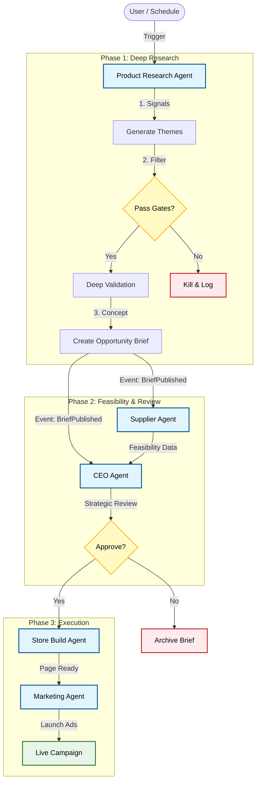

# 🚀 Workflow 1: The Growth Engine (Product Launch)

**Objective:** To systematically identify high-potential products, generate rigorous Opportunity Briefs, validate unit economics, and bring winners to market.
**Trigger:** Scheduled (Daily) OR Manual Command (`"Find a winning product in the Pet niche"`).
**Owner:** CEO Agent (Orchestrator) & Product Research Agent (Lead)

---

## 📊 Workflow Diagram

---

## 📝 Detailed Steps & Technical Actions

### Phase 1: Deep Research & Opportunity Briefing
*   **Actor:** `ProductResearchAgent`
*   **Trigger Event:** `RESEARCH_REQUESTED`
*   **Process:** The agent executes a rigorous 8-step pipeline:
    1.  **Signal Collection:** Aggregates data from Social, Search, and Marketplaces.
    2.  **Theme Generation:** Clusters signals into coherent product themes.
    3.  **Gating:** Applies strict "Kill Criteria" (e.g., margin < 20%, high return risk).
    4.  **Validation:** Checks competition density and pricing viability.
    5.  **Brief Creation:** Generates a structured **Opportunity Brief** with 14 required sections.
*   **Key Artifact:** `OpportunityBrief` (JSON) containing:
    *   `kill_criteria`: Explicit stop rules.
    *   `validation_plan`: How to test the product.
    *   `assumptions_and_certainty`: Confidence levels.
    *   `evidence_references`: Traceability to source signals.
*   **Output Event:** `OpportunityResearch.BriefsPublished`

### Phase 2: Feasibility & Strategic Review
*   **Actor:** `SupplierAgent` & `CEOAgent`
*   **Trigger Event:** `OpportunityResearch.BriefsPublished`
*   **Parallel Execution:**
    *   **CEO Agent (Strategic Filter):** Immediately reviews the Brief against the `StrategyProfile`. If the product category or risk level violates strategy, the CEO **rejects** the brief immediately ("Fast Fail"), bypassing the need for deep sourcing.
    *   **Supplier Agent (Feasibility Check):** Simultaneously searches for real suppliers to validate the `estimated_cost` and `logistics` assumptions in the Brief.
*   **Convergence:** If the CEO passes the strategic check, they wait for the Supplier Agent's feasibility data before making the final `Approval` decision.
*   **Output Event:** `PRODUCT_APPROVED` or `PRODUCT_REJECTED`

### Phase 3: Store Build & Asset Creation
*   **Actor:** `StoreBuildAgent`
*   **Trigger Event:** `PRODUCT_APPROVED`
*   **Actions:**
    *   Uses the `offer_concept` and `differentiation_strategy` from the Brief to write copy and design images.
    *   Creates the product page on Shopify.
*   **Output Event:** `PRODUCT_PAGE_CREATED`

### Phase 4: Marketing Launch
*   **Actor:** `MarketingAgent`
*   **Trigger Event:** `PRODUCT_PAGE_CREATED`
*   **Actions:**
    *   Executes the `validation_plan` defined in the Brief.
    *   Launches "Smoke Test" ads or full campaigns.
*   **Output Event:** `CAMPAIGN_STARTED`

---

## 🚦 Exception Handling

| Scenario | Trigger Event | Handler Agent | Action |
| :--- | :--- | :--- | :--- |
| **No Themes Found** | `RESEARCH_COMPLETED` (Empty) | `ProductResearchAgent` | Wait 6 hours, retry with broader category. |
| **Kill Criteria Met** | `GATE_FAILED` | `ProductResearchAgent` | Log failure reason, archive theme. |
| **Feasibility Failed** | `FEASIBILITY_FAILED` | `SupplierAgent` | Update Brief with risk data, CEO rejects. |
| **Ad Rejected** | `AD_REJECTED` | `MarketingAgent` | Read rejection reason, modify copy (Compliance Check), re-submit. |

---
**Next Step:** Once the campaign is live, the system transitions to [**Workflow 2: Operations**](./02_OPERATIONS.md) to handle orders, or [**Workflow 3: Optimization**](./03_OPTIMIZATION.md) to analyze test results.
