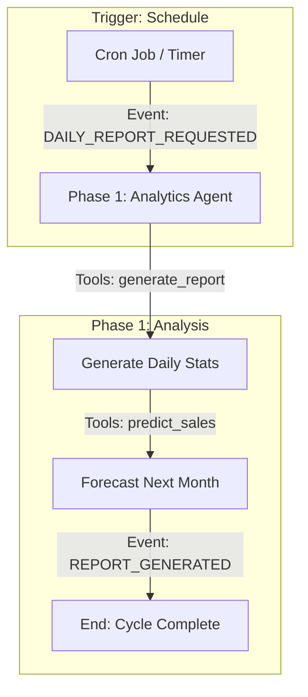

# 🧠 Workflow 3: The Optimization Engine (The Brain)

**Objective:** To continuously analyze financial performance, maximize Return on Ad Spend (ROAS), and make data-driven decisions to Scale or Kill products.
**Trigger:** Periodic Schedule (Every 6 Hours) OR "Budget Exhausted" Alert.
**Owner:** Analytics Agent (Analyst) & Marketing Agent (Executor)

---

## 📊 Workflow Diagram

---

## 📝 Detailed Steps & Technical Actions

### Phase 1: Reporting & Forecasting
*   **Actor:** `AnalyticsAgent`
*   **Trigger Event:** `DAILY_REPORT_REQUESTED`
*   **MCP Tools / Actions:**
    *   `generate_report`: Aggregates revenue, costs, and profit (Mock or Real).
    *   `predict_sales`: Forecasts future performance based on current trends.
*   **Output Event:** `REPORT_GENERATED` (Log Output)

---
**Next Step:** Insights from reports drive new product searches in [**Workflow 1: Growth**](./01_GROWTH.md).

### Phase 1: Data Aggregation (The Truth)
*   **Actor:** `AnalyticsAgent`
*   **Trigger Event:** `OPTIMIZATION_TICK` (Cron Job)
*   **MCP Tools / Actions:**
    *   `meta_ads.get_insights(date_preset="today")`: Fetch Spend, Impressions, Clicks, CTR.
    *   `shopify.get_sales_report(date_preset="today")`: Fetch Revenue, Orders.
    *   `calculator.calculate_roas(revenue, spend)`: Compute ROAS.
    *   `calculator.calculate_net_profit(revenue, spend, cogs, fees)`: Compute Real Profit.
*   **Logic:**
    1.  **Attribution:** Match Shopify Orders to Ad Campaigns (using UTM tags).
    2.  **Sanity Check:** Ensure Ad Spend data is up-to-date (Meta API often lags 15 mins).
*   **Output Event:** `DATA_READY`
    *   **Payload:** `{ "campaign_id": "fb_555", "spend": 100, "revenue": 250, "roas": 2.5, "cpa": 12.50 }`

### Phase 2: Decision Logic (The Rules)
*   **Actor:** `AnalyticsAgent`
*   **Trigger Event:** `DATA_READY`
*   **Logic:**
    *   **Kill Rule:** If Spend > $50 AND Orders = 0 -> **KILL**.
    *   **Kill Rule:** If Spend > $100 AND ROAS < 1.5 (Break-even) -> **KILL**.
    *   **Scale Rule:** If ROAS > 3.0 AND CPA < $15 -> **SCALE** (Increase Budget 20%).
    *   **Optimize Rule:** If ROAS is 1.5 - 3.0 -> **HOLD** (Request new creatives).
*   **Output Event:** `DECISION_MADE`
    *   **Payload:** `{ "action": "SCALE", "campaign_id": "fb_555", "reason": "High ROAS (3.5)" }`

### Phase 3: Execution (The Hands)
*   **Actor:** `MarketingAgent`
*   **Trigger Event:** `DECISION_MADE`
*   **MCP Tools / Actions:**
    *   `meta_ads.update_budget(campaign_id, increase_by_percent=20)`: Scale.
    *   `meta_ads.pause_campaign(campaign_id)`: Kill.
    *   `llm.generate_ad_creative(feedback)`: Generate new angles for "Optimize" phase.
*   **Logic:**
    1.  **Safety Check:** Never increase budget more than 1x per 24h (prevents algorithm reset).
    2.  **Execution:** Call the API to apply changes.
*   **Output Event:** `BUDGET_INCREASED` / `AD_PAUSED`

### Phase 4: Strategic Review (The Pivot)
*   **Actor:** `CEOAgent`
*   **Trigger Event:** `AD_PAUSED` (Accumulated)
*   **Logic:**
    1.  **Product Health:** If all campaigns for "Neck Massager" are killed -> **Archive Product**.
    2.  **Pivot:** If 3 products fail in a row -> **Change Niche** (Trigger `WORKFLOW_GROWTH` with new category).
*   **Output Event:** `STRATEGY_UPDATED`

---

## 🚦 Exception Handling

| Scenario | Trigger Event | Handler Agent | Action |
| :--- | :--- | :--- | :--- |
| **Data Mismatch** | `DATA_ERROR` | `AnalyticsAgent` | If Shopify Revenue << Ad Spend (impossible ROAS), alert User to check Pixel. |
| **Runaway Spend** | `SPEND_ALERT` | `CEOAgent` | If Daily Spend > Global Cap ($500), **Emergency Stop** all ads. |
| **Ad Account Ban** | `ACCOUNT_DISABLED` | `MarketingAgent` | Pause all internal workflows. Alert User immediately via SMS/Email. |
