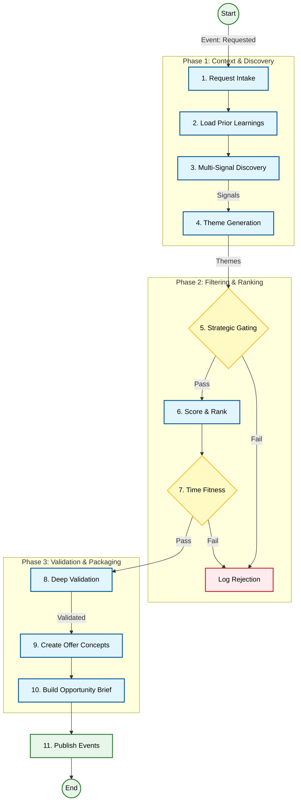

# 🕵️ Product Research Agent Workflow

**Role:** The "Hunter" of the system. It autonomously scans the market, identifies emerging trends, and packages them into structured business opportunities.
**Input:** `OpportunityResearch.Requested` (Event)
**Output:** `OpportunityResearch.BriefsPublished` (Event) containing `OpportunityBrief[]`

---

## 🧠 Internal Logic Flow

The agent executes a rigorous **11-Step Pipeline** to ensure only high-quality, validated opportunities reach the CEO.



---

## 📝 Detailed Step-by-Step Execution

### 1. Request Intake & Normalization
*   **Goal:** Parse the incoming request and align it with the global `StrategyProfile`.
*   **Input:** `ResearchRequest` (ID, Query, Parameters).
*   **Action:** Validates that the request parameters (e.g., "Pet Niche") are allowed by the current strategy.
*   **Output:** `ResearchBrief` (Internal working object).

### 2. Prior Learning Ingestion
*   **Goal:** Avoid repeating past mistakes.
*   **Action:** Queries the `PersistencePort` for past product failures or successes in the target category.
*   **Output:** `RiskAdjustment[]` (Factors that will penalize or boost scores later).

### 3. Multi-Signal Discovery
*   **Goal:** Gather raw market data.
*   **MCP Tools Used:**
    *   `trend_adapter.analyze_trends(keywords)`: Google Trends, Pinterest.
    *   `competitor_adapter.scan_market(category)`: Amazon Best Sellers, TikTok Creative Center.
*   **Output:** `Signal[]` (Raw data points with source and timestamp).

### 4. Theme Generation
*   **Goal:** Make sense of the noise.
*   **Action:** Clusters raw signals into coherent "Themes" (e.g., "Heated Neck Massager" + "Portable Heat Pack" -> "On-the-go Heat Therapy").
*   **Output:** `Theme[]` (Candidate product ideas).

### 5. Strategic Gating (The "Kill Switch")
*   **Goal:** Filter out bad ideas early.
*   **Logic:** Checks themes against `StrategyProfile`.
    *   *Is the margin potential > 20%?*
    *   *Is the category allowed?*
*   **Output:** `Theme[]` (Filtered list).

### 6. Scoring & Ranking
*   **Goal:** Prioritize the best ideas.
*   **Action:** Calculates a score (0-100) based on:
    *   Signal Strength (Volume, Velocity).
    *   `RiskAdjustment` factors from Step 2.
*   **Output:** Ranked `Theme[]`.

### 7. Time & Cycle Fitness
*   **Goal:** Ensure timing is right.
*   **Action:** Checks `TrendPhase`.
    *   *Too Early?* -> Wait.
    *   *Too Late?* -> Reject (Saturated).
    *   *Just Right?* -> Proceed.
*   **Output:** `Theme[]` (Time-validated).

### 8. Deep Validation
*   **Goal:** Prove the concept before building.
*   **MCP Tools Used:**
    *   `competitor_adapter.analyze_saturation()`: How many sellers?
    *   `trend_adapter.check_seasonality()`: Is it just a fad?
*   **Output:** `ValidationData` (Competition density, Price bands).

### 9. Productization (Offer Concepts)
*   **Goal:** Turn a "Theme" into a "Product".
*   **Action:** Defines the `OfferConcept`:
    *   Core Hypothesis.
    *   Differentiation Strategy (Bundles, Angles).
    *   Target Persona.
*   **Output:** `ProductConcept[]`.

### 10. Opportunity Brief Creation
*   **Goal:** Create the final artifact.
*   **Action:** Maps all gathered data into the strict **Opportunity Brief Schema**.
*   **Key Fields Populated:**
    *   `kill_criteria`: Hard rules for the CEO to check.
    *   `validation_plan`: Recommended ad tests.
    *   `assumptions_and_certainty`: Confidence score.
    *   `evidence_references`: Links to source signals.
*   **Output:** `OpportunityBrief[]`.

### 11. Handoff
*   **Goal:** Notify the system.
*   **Events Published:**
    *   `OpportunityResearch.BriefsPublished`: The main payload for Supplier/CEO agents.
    *   `OpportunityResearch.SignalsCollected`: For the Analytics Agent.

---

## 📂 Key Data Structures

### Opportunity Brief (The Artifact)
The central JSON document passed to downstream agents.
*   See [Schema Definition](../../Product%20Research%20Agent/doc_3_opportunity_brief_schema.md) for full details.

### Signal
```typescript
interface Signal {
    id: string;
    family: 'social' | 'search' | 'marketplace' | 'competitor';
    source: string; // e.g., "TikTok", "Google Trends"
    data: any;
}
```

### Theme
```typescript
interface Theme {
    id: string;
    name: string;
    supporting_signals: string[]; // IDs
    score: number;
    validation: ValidationData;
}
```

---

## 🔌 MCP Tool Integrations

| Tool Category | Adapter Port | Purpose |
| :--- | :--- | :--- |
| **Trends** | `TrendAnalysisPort` | Identify rising keywords and consumer interests. |
| **Competitors** | `CompetitorAnalysisPort` | Analyze market saturation, pricing, and existing offers. |
| **Database** | `PersistencePort` | Retrieve past learnings and store new briefs. |
