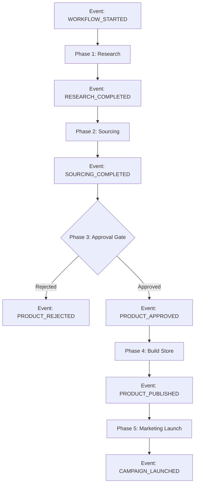

# 🚀 Workflow 1: The Growth Engine (Product Launch)

**Objective:** To systematically identify high-potential products, validate their unit economics, and bring them to market with a live ad campaign.
**Trigger:** Scheduled (Daily at 08:00 AM) OR Manual Command (`"Launch a new product in the Pet niche"`).
**Owner:** CEO Agent (Orchestrator)

---

## 📊 Workflow Diagram

---

## 📝 Detailed Steps & Technical Actions

### Phase 1: Opportunity Detection
*   **Actor:** `ProductResearchAgent`
*   **Trigger Event:** `WORKFLOW_STARTED`
*   **MCP Tools / Actions:**
    *   `google_trends.interest_over_time(keyword)`: Check search volume trajectory.
    *   `brave_search.search(query)`: Find competitor stores and pricing.
    *   `amazon_scraper.get_best_sellers(category)`: Validate demand on marketplaces.
*   **Logic:**
    1.  **Scan Trends:** Identify rising keywords (e.g., "heated neck massager").
    2.  **Competitor Analysis:** Check Amazon Best Sellers and Facebook Ad Library.
    3.  **Validation:** Ensure the product solves a problem and has a "Wow" factor.
*   **Output Event:** `RESEARCH_COMPLETED`
    *   **Payload:** `{ "product_name": "Smart Neck Massager", "competitor_price": 49.99, "confidence_score": 85 }`

### Phase 2: Feasibility & Sourcing
*   **Actor:** `SupplierAgent`
*   **Trigger Event:** `RESEARCH_COMPLETED`
*   **MCP Tools / Actions:**
    *   `aliexpress.search_products(image_url)`: Find visual matches for the product.
    *   `supplier_db.get_rating(supplier_id)`: Check supplier reliability score.
    *   `calculator.landed_cost(unit_cost, shipping, taxes)`: Compute total COGS.
*   **Logic:**
    1.  **Supplier Search:** Query AliExpress/CJ Dropshipping for matching items.
    2.  **Vetting:** Filter by Rating > 4.5 and Shipping < 15 days.
    3.  **Cost Analysis:** Calculate COGS (Cost of Goods Sold) + Shipping.
*   **Output Event:** `SOURCING_COMPLETED`
    *   **Payload:** `{ "supplier_id": "ali_123", "unit_cost": 12.50, "shipping": 4.00, "margin_percent": 0.67 }`

### Phase 3: The Green Light (Approval Gate)
*   **Actor:** `CEOAgent` (and **User** in Live Mode)
*   **Trigger Event:** `SOURCING_COMPLETED`
*   **MCP Tools / Actions:**
    *   `admin_panel.send_notification(message, actions)`: Prompt user for approval.
    *   `db.save_decision(decision_data)`: Log the approval/rejection for audit.
*   **Logic:**
    1.  **Profitability Check:** Is Gross Margin > 30%? ( ($49.99 - $16.50) / $49.99 = 67% ✅ )
    2.  **Risk Check:** Is the supplier reliable?
*   **Approval Process:**
    *   **Mock Mode:** CEO Agent auto-approves if logic passes.
    *   **Live Mode:** CEO Agent pauses and sends a **Notification** to the User (Admin Panel / Email).
        *   *"I found a Neck Massager with 67% margin. Ready to launch? [YES/NO]"*
*   **Output Event:** `PRODUCT_APPROVED` or `PRODUCT_REJECTED`

### Phase 4: Asset Creation
*   **Actor:** `StoreBuildAgent`
*   **Trigger Event:** `PRODUCT_APPROVED`
*   **MCP Tools / Actions:**
    *   `llm.generate_copy(prompt)`: Write SEO-optimized title and description.
    *   `image_processor.remove_background(url)`: Clean up supplier images.
    *   `shopify.product_create(product_json)`: Push data to the store.
*   **Logic:**
    1.  **Copywriting:** Generate persuasive title, description, and benefits using LLM.
    2.  **Image Processing:** Fetch supplier images, remove watermarks, upscale (TinyPNG).
    3.  **Platform Push:** Create Product in Shopify (via API).
*   **Output Event:** `PRODUCT_PUBLISHED`
    *   **Payload:** `{ "shopify_id": "prod_999", "url": "myshop.com/products/smart-neck-massager" }`

### Phase 5: Go-to-Market (Launch)
*   **Actor:** `MarketingAgent`
*   **Trigger Event:** `PRODUCT_PUBLISHED`
*   **MCP Tools / Actions:**
    *   `llm.generate_ad_creative(product_info)`: Create ad hooks and headlines.
    *   `meta_ads.create_campaign(objective="CONVERSIONS")`: Initialize campaign structure.
    *   `meta_ads.create_ad(creative_id, audience_id)`: Deploy the ads.
*   **Logic:**
    1.  **Creative Gen:** Generate Ad Copy ("Stop Neck Pain Today!") and select best images.
    2.  **Targeting:** Define audience (e.g., "Interests: Yoga, Office Workers").
    3.  **Campaign Setup:** Create Campaign in Meta Ads Manager.
    4.  **Budgeting:** Set initial test budget (e.g., $50/day).
*   **Output Event:** `CAMPAIGN_LAUNCHED`
    *   **Payload:** `{ "campaign_id": "fb_camp_555", "status": "IN_REVIEW", "budget": 50.00 }`

---

## 🚦 Exception Handling

| Scenario | Trigger Event | Handler Agent | Action |
| :--- | :--- | :--- | :--- |
| **No Products Found** | `RESEARCH_FAILED` | `ProductResearchAgent` | Wait 6 hours, retry with broader category. |
| **Margin Too Low** | `SOURCING_FAILED` | `CEOAgent` | Reject candidate. Log failure to avoid retrying same item. |
| **API Error (Shopify)** | `BUILD_ERROR` | `StoreBuildAgent` | Retry 3 times, then emit `CRITICAL_ERROR` for User intervention. |
| **Ad Rejected** | `AD_REJECTED` | `MarketingAgent` | Read rejection reason, modify copy (Compliance Check), re-submit. |
